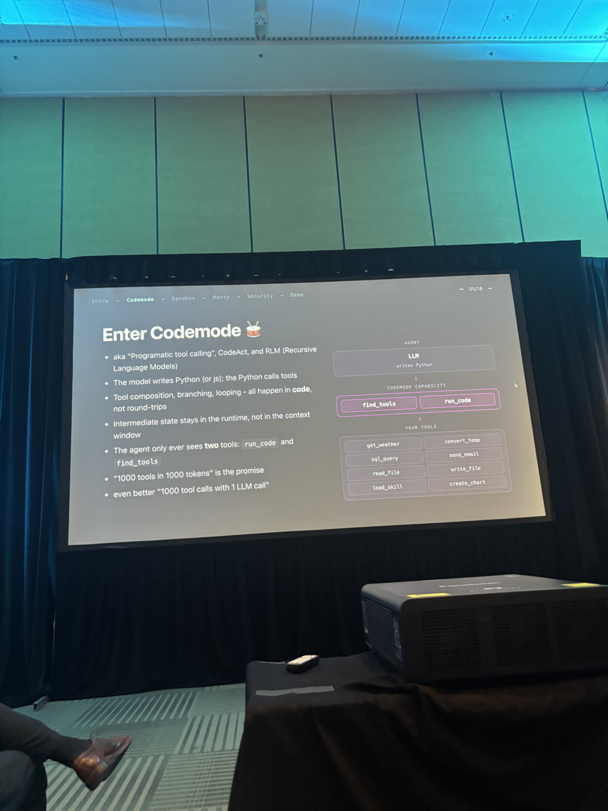
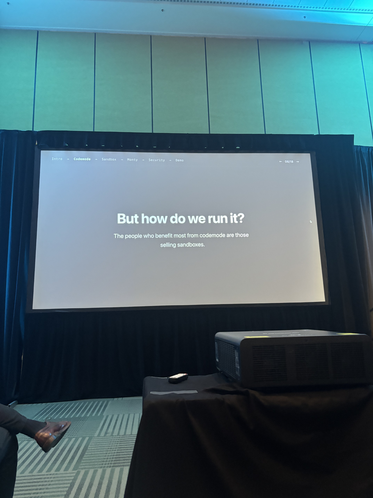
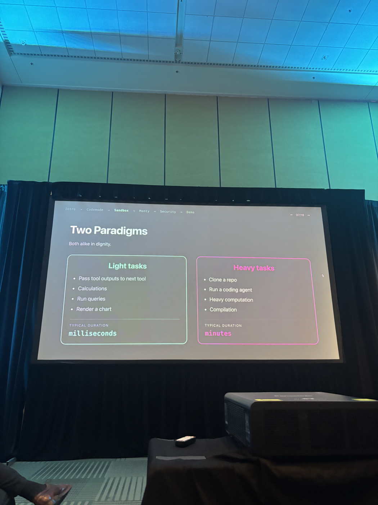
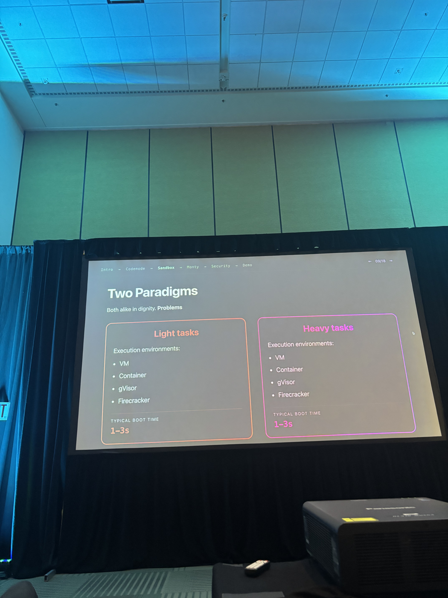
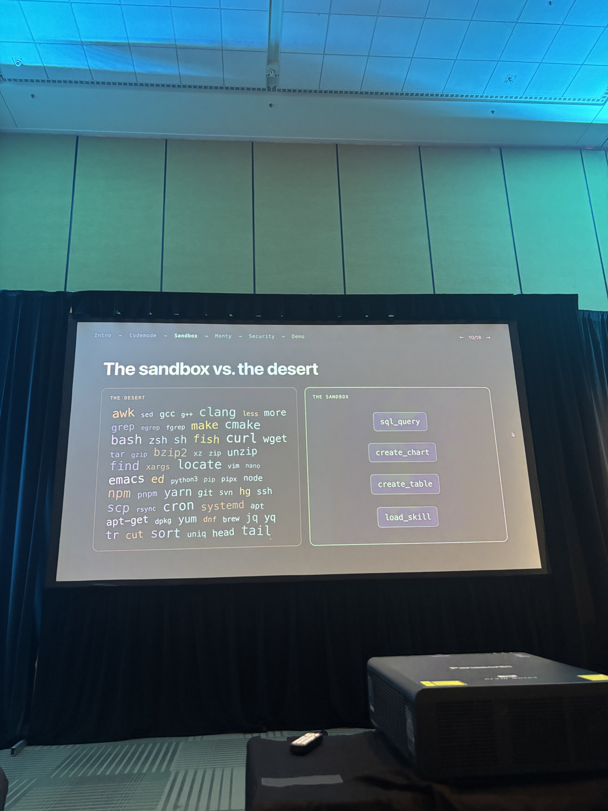
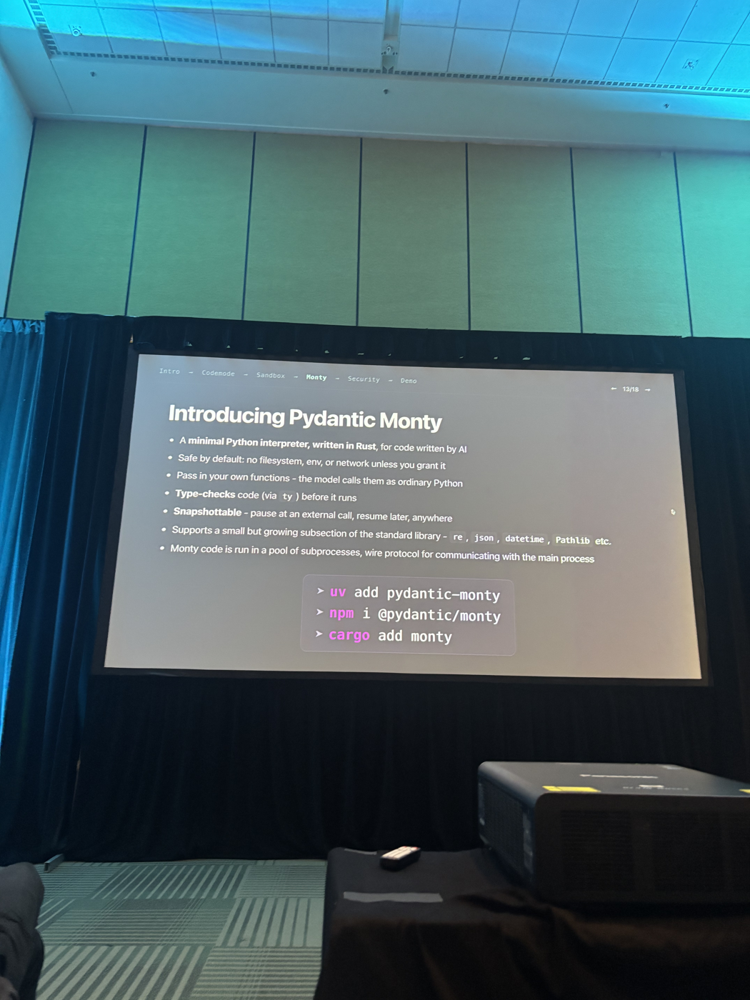

# Your agent needs a sandbox, not a desert

**Speaker:** Samuel Colvin  
**Role:** Founder & CEO  
**Company:** Pydantic  
**Event:** AI Engineer World Fair, San Francisco  
**Day:** Day 3 — Session Day 2  
**Time:** 12:05pm–12:25pm  
**Room:** Track 1  
**Track:** Sandbox & Platform Engineering  
**Twitter:** https://x.com/samuelcolvin  

---

Talk notes from slides (6 captured, slide deck is 18 slides total with sections: Intro → Codemode → Sandbox → Monty → Security → Demo)

**Slide photos:** `raw/slides/agent-needs-sandbox-not-desert/`  
Original HEIC files: IMG_8781–IMG_8786.HEIC  
PNG conversions: slide-05-codemode.png, slide-06-but-how-do-we-run-it.png, slide-07-two-paradigms.png, slide-09-two-paradigms-problems.png, slide-10-sandbox-vs-desert.png, slide-12-pydantic-monty.png

---

## Slide 5/18 — Enter Codemode 🥁



aka "Programatic tool calling", CodeAct, and RLM (Recursive Language Models)

- The model writes Python (or js); the Python calls tools
- Tool composition, branching, looping — all happen in **code**, not round-trips
- Intermediate state stays in the runtime, not in the context window
- The agent only ever sees **two** tools: `run_code` and `find_tools`
- "1000 tools in 1000 tokens" is the promise
- even better: "1000 tool calls with 1 LLM call"

Architecture diagram on slide:
- AGENT → LLM (writes Python) → CODEMODE CAPABILITY (`find_tools`, `run_code`) → YOUR TOOLS (`get_weather`, `sql_query`, `read_file`, `load_skill`, `convert_temp`, `send_email`, `write_file`, `create_chart`)

---

## Slide 6/18 — But how do we run it?



> The people who benefit most from codemode are those selling sandboxes.

---

## Slide 7/18 — Two Paradigms



*Both alike in dignity.*

| | Light tasks | Heavy tasks |
|---|---|---|
| Examples | Pass tool outputs to next tool, Calculations, Run queries, Render a chart | Clone a repo, Run a coding agent, Heavy computation, Compilation |
| Typical duration | **milliseconds** | **minutes** |

---

## Slide 9/18 — Two Paradigms (Problems)



*Both alike in dignity. **Problems.***

Both light and heavy tasks share the same execution environments — and the same boot time problem:

| | Light tasks | Heavy tasks |
|---|---|---|
| Execution environments | VM, Container, gVisor, Firecracker | VM, Container, gVisor, Firecracker |
| Typical boot time | **1–3s** | **1–3s** |

Key tension: a light task takes milliseconds of compute but 1–3s just to boot its sandbox.

---

## Slide 10/18 — The sandbox vs. the desert



**THE DESERT** — a raw shell environment exposes everything:
`awk` `sed` `gcc` `g++` `clang` `less` `more` `grep` `egrep` `fgrep` `make` `cmake` `bash` `zsh` `sh` `fish` `curl` `wget` `tar` `gzip` `bzip2` `xz` `zip` `unzip` `find` `xargs` `locate` `vim` `nano` `emacs` `ed` `python3` `pip` `pipx` `node` `npm` `pnpm` `yarn` `git` `svn` `hg` `ssh` `scp` `rsync` `cron` `systemd` `apt` `apt-get` `dpkg` `yum` `dnf` `brew` `jq` `yq` `tr` `cut` `sort` `uniq` `head` `tail`

**THE SANDBOX** — exposes only what the agent actually needs:
- `sql_query`
- `create_chart`
- `create_table`
- `load_skill`

---

## Slide 12/18 — Introducing Pydantic Monty



A minimal Python interpreter, **written in Rust**, for code written by AI.

- Safe by default: no filesystem, env, or network unless you grant it
- Pass in your own functions — the model calls them as ordinary Python
- **Type-checks** code (via `ty`) before it runs
- **Snapshottable** — pause at an external call, resume later, anywhere
- Supports a small but growing subsection of the standard library: `re`, `json`, `datetime`, `Pathlib` etc.
- Monty code is run in a pool of subprocesses, wire protocol for communicating with the main process

Install:
```
uv add pydantic-monty
npm i @pydantic/monty
cargo add monty
```

---

## My notes

- Only captured 6 of 18 slides (slides 5, 6, 7, 9, 10, 12). Missing: Intro section, slides 8, 11, and the Security + Demo sections.
- The talk is from the Pydantic team (given the Pydantic Monty product announcement)
- Central thesis: giving agents a raw shell ("the desert") is dangerous and unnecessary — a curated sandbox with only the tools the agent needs is both safer and simpler
- The boot time problem is interesting: even for millisecond-duration light tasks, sandboxes take 1–3s to spin up — this is a real friction point for codemode agents
- Monty feels like a direct answer to the "how do we run it safely?" question from slide 6
