# Letting the Interns Loose — How We Accelerated AI Adoption
**Speaker:** Shashank Goyal — Head of Provider Ecosystem & Founding Engineer, OpenRouter
**Date:** 2026-07-05
**Time:** 11:10am–11:30am
**Track:** Sandbox & Platform Engineering
**Room:** Track 1
**Day:** Day 3 (Session Day 2)

**Speaker bio:** Previously backend engineer at OpenSea and 4+ years at Google. Focuses on large-scale infrastructure, developer platforms, and AI systems. LinkedIn: https://www.linkedin.com/in/shashankgoyal1/ | Twitter: https://x.com/shashankgoyal95

**Source:** Slides captured during talk (14 slides; earlier slides ~1–7 and some mid-deck slides not captured)

**Slide photos:** `raw/slides/letting-the-interns-loose/` — 14 originals (HEIC) + 14 converted JPGs

---

## Core Framing: The Intern Mental Model

The talk reframes AI coding agents as "interns" — not generic assistants but narrow, persistent, delegatable coworkers. The key thesis is that constraints make agents reliable.

### An Intern vs a Generic Agent [slide ~8]

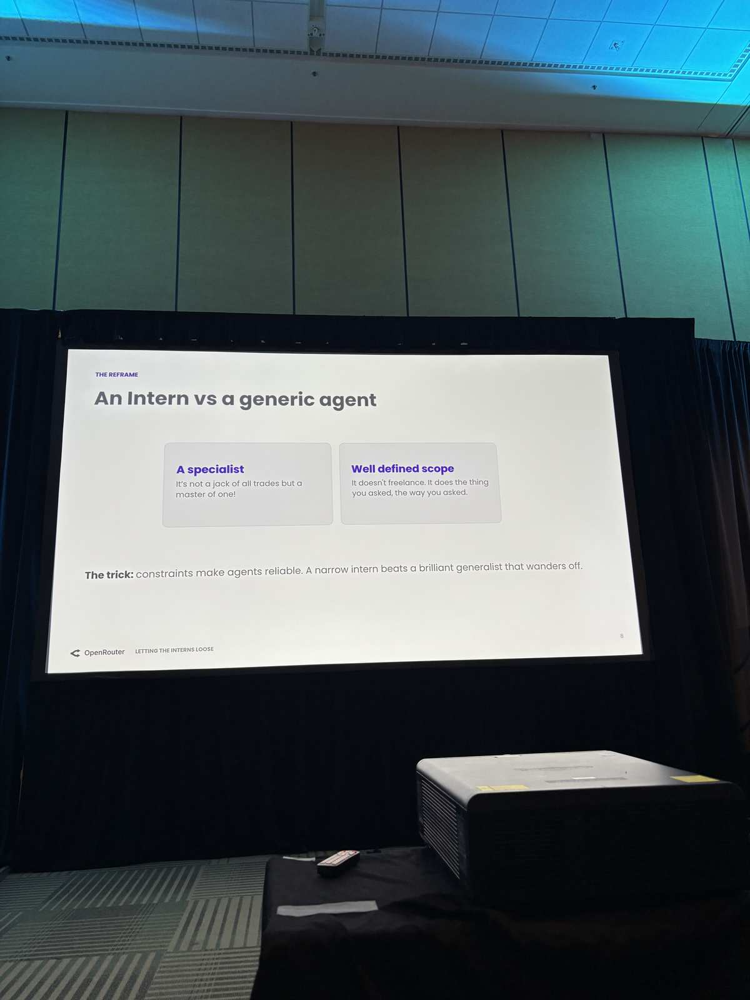

- **A specialist** — Not a jack of all trades but a master of one.
- **Well defined scope** — It doesn't freelance. It does the thing you asked, the way you asked.
- **The trick:** constraints make agents reliable. A narrow intern beats a brilliant generalist that wanders off.

---

## The Fix: Three Abstractions [slide 9]

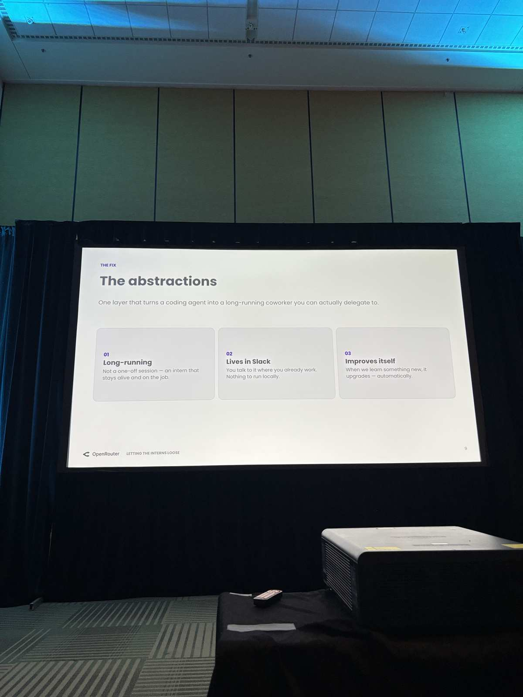

"One layer that turns a coding agent into a long-running coworker you can actually delegate to."

1. **Long-running** — Not a one-off session — an intern that stays alive and on the job.
2. **Lives in Slack** — You talk to it where you already work. Nothing to run locally.
3. **Improves itself** — When we learn something new, it upgrades — automatically.

---

## Config: Every Intern is a Git Repo [slide 12]

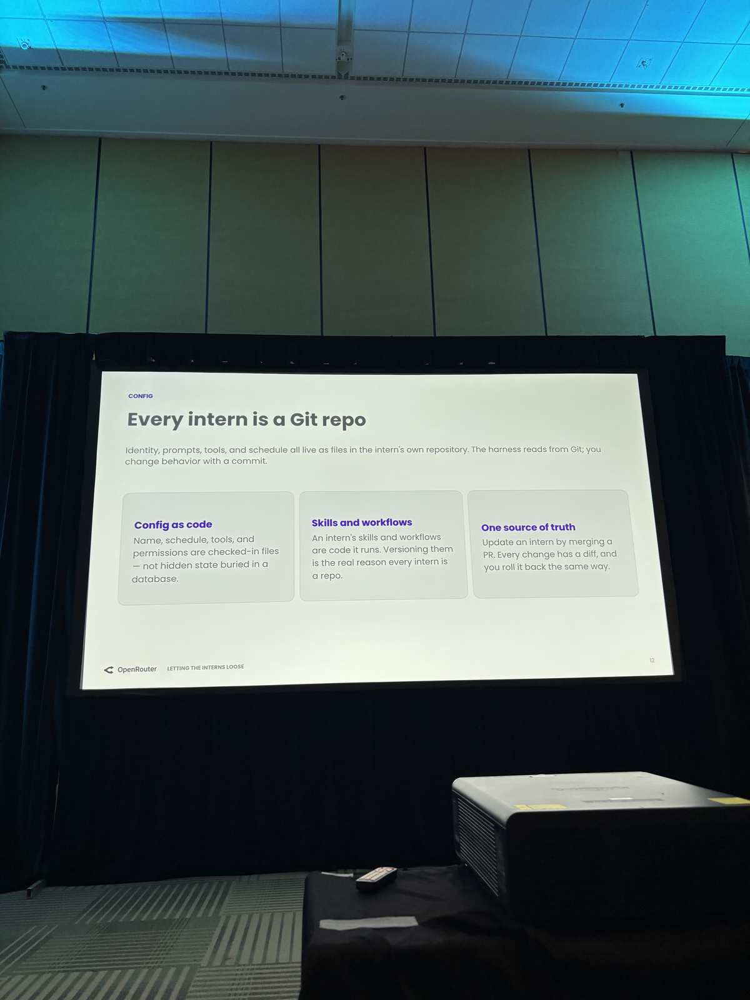

"Identity, prompts, tools, and schedule all live as files in the intern's own repository. The harness reads from Git; you change behavior with a commit."

- **Config as code** — Name, schedule, tools, and permissions are checked-in files — not hidden state buried in a database.
- **Skills and workflows** — An intern's skills and workflows are code it runs. Versioning them is the real reason every intern is a repo.
- **One source of truth** — Update an intern by merging a PR. Every change has a diff, and you roll it back the same way.

### Example: The "buddy" repo [slide ~12]

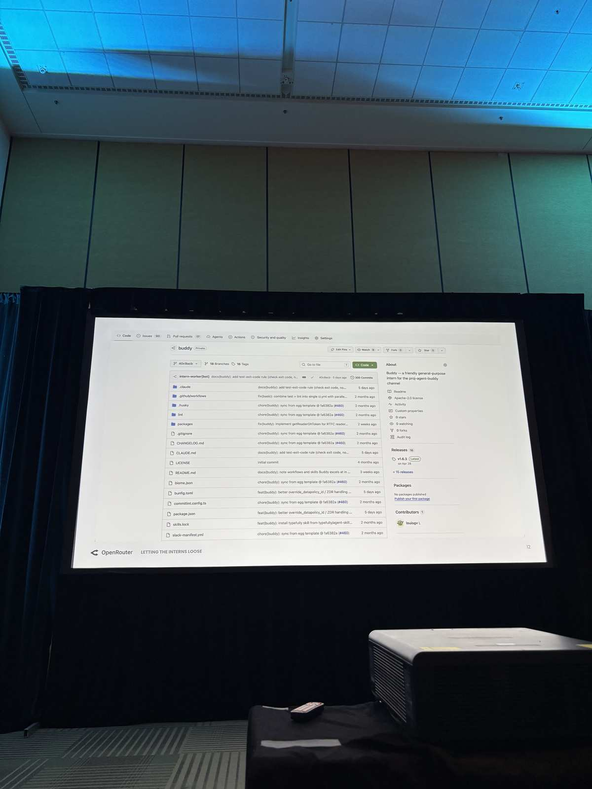

Showed a live GitHub repo named "buddy" (Private):
- Branch: `intern-worker[bot]`; 18 branches, 16 tags, ~300 commits
- About: "Buddy — a friendly general-purpose intern for the pnp-agent-buddy channel"
- Repo files visible: `.claude`, `.github/workflows`, `.husky`, `lint/`, `packages/`, `CHANGELOG.md`, `CLAUDE.md`, `LICENSE`, `README.md`, `biome.json`, `bunfig.toml`, `commitlint.config.ts`, `package.json`, `skills.lock`, `slack-manifest.yml`
- Latest release: v1.6.3 (Apr 28); +10 releases total
- 1 contributor (louisgy L)

---

## Runtime: One VM per Intern [slide 13]

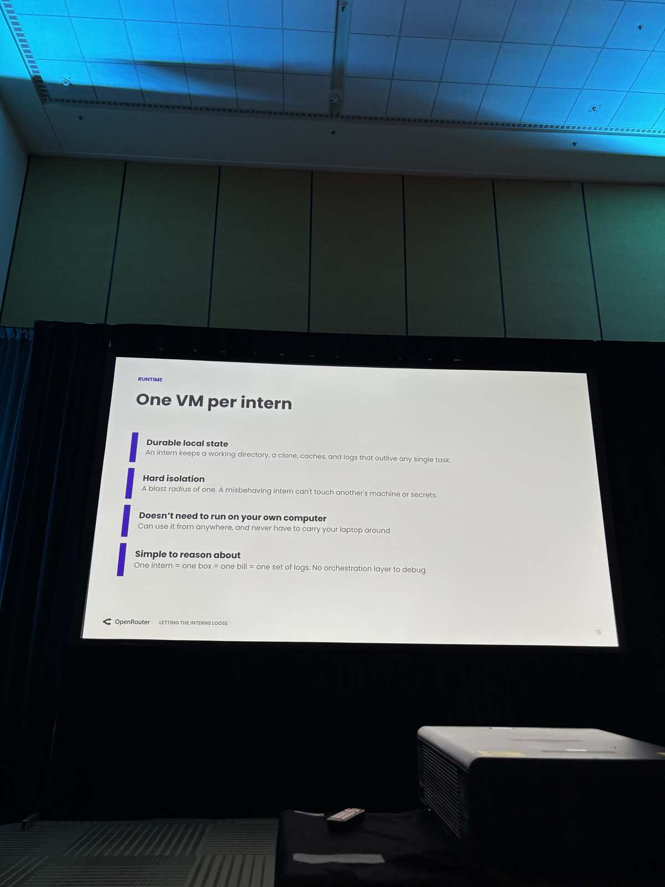

- **Durable local state** — An intern keeps a working directory, a clone, caches, and logs that outlive any single task.
- **Hard isolation** — A blast radius of one. A misbehaving intern can't touch another's machine or secrets.
- **Doesn't need to run on your own computer** — Can use it from anywhere, and never have to carry your laptop around.
- **Simple to reason about** — One intern = one box = one bill = one set of logs. No orchestration layer to debug.

---

## Security: Interns Can't Read Their Own Secrets [slide 14]

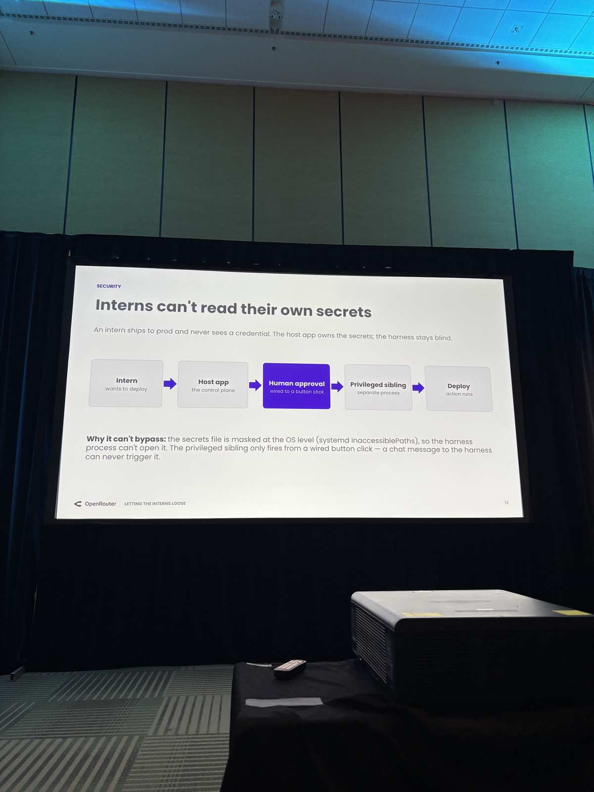

"An intern ships to prod and never sees a credential. The host app owns the secrets; the harness stays blind."

Deployment flow shown:
> **Intern** (wants to deploy) → **Host app** (the control plane) → **Human approval** (wired to a button click) → **Privileged sibling** (separate process) → **Deploy** (action runs)

**Why it can't bypass:** the secrets file is masked at the OS level (`systemd InaccessiblePaths`), so the harness process can't open it. The privileged sibling only fires from a wired button click — a chat message to the harness can never trigger it.

---

## Skill Marketplace [slide 15]

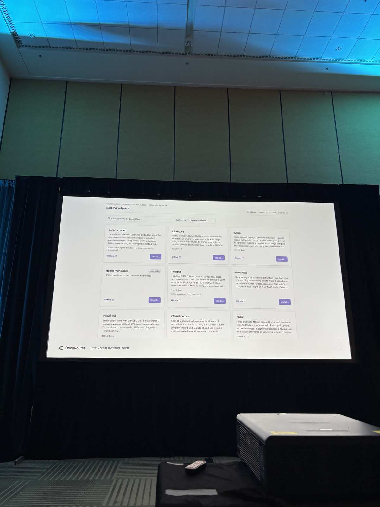

Showed a UI for a "Skill Marketplace" — interns can install skills from a shared marketplace. Skills visible in the screenshot include: `agent-browser`, `clickhouse`, `fusion`, `google-workspace`, `hubspot`, `humanizer`, `install-skill`, `internal-comms`, `notion`. Each skill has a GitHub link and an "Install" button, scoped to a specific intern via a dropdown.

---

## How She Hatches Them: The Egg [slide 18]

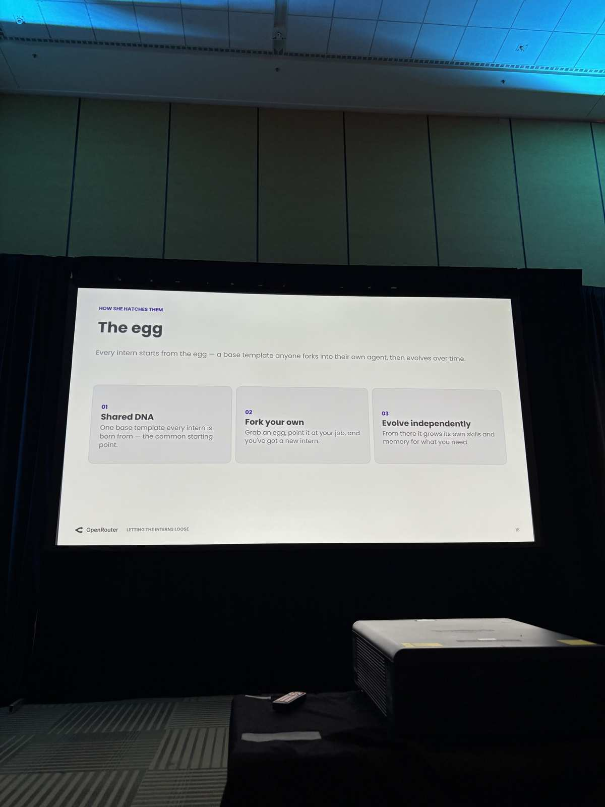

"Every intern starts from the egg — a base template anyone forks into their own agent, then evolves over time."

1. **Shared DNA** — One base template every intern is born from — the common starting point.
2. **Fork your own** — Grab an egg, point it at your job, and you've got a new intern.
3. **Evolve independently** — From there it grows its own skills and memory for what you need.

---

## Results [slide 20]

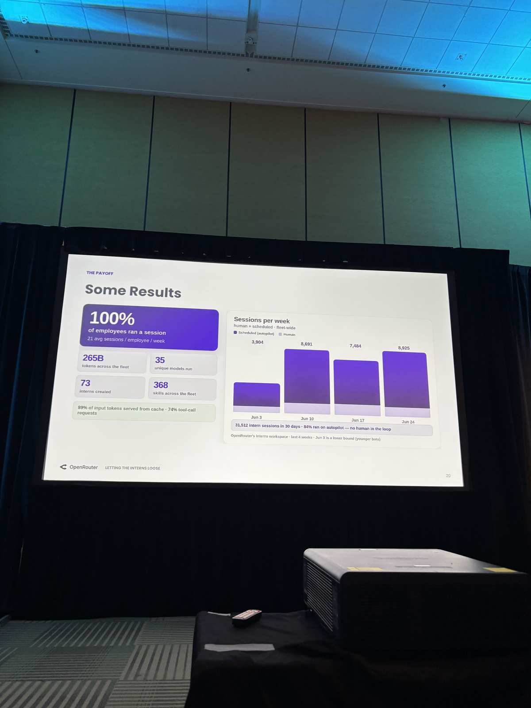

Fleet metrics (OpenRouter's interns workspace, last 4 weeks as of talk date):

- **100% of employees** ran a session — 21 avg sessions / employee / week
- **265B** tokens across the fleet
- **35** unique models run
- **73** interns created
- **368** skills across the fleet
- **89%** of input tokens served from cache; **74%** tool-call requests

Sessions per week (human + scheduled):
| Week of  | Total sessions |
|----------|---------------|
| Jun 3    | 3,904         |
| Jun 10   | 8,691         |
| Jun 17   | 7,484         |
| Jun 24   | 8,925         |

**31,512 intern sessions in 30 days — 84% ran on autopilot — no human in the loop**
*(Jun 3 is a lower bound; younger bots were still ramping)*

---

## Meet the Fleet — Example Interns

### buddy [slide ~21]

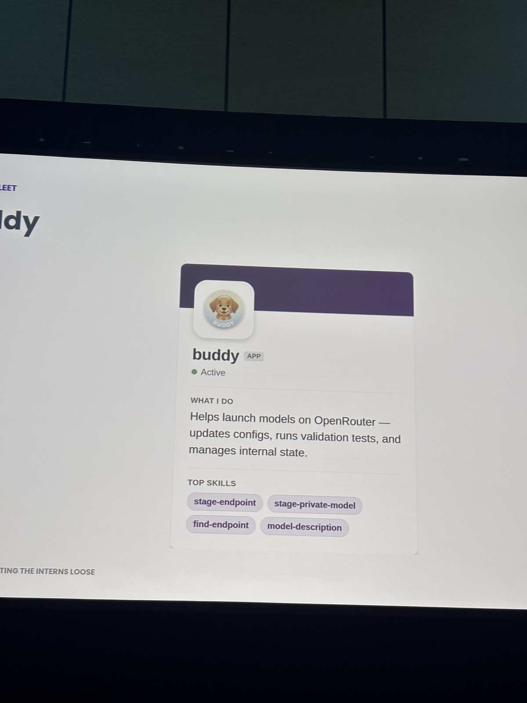

- **Active**
- **What I do:** Helps launch models on OpenRouter — updates configs, runs validation tests, and manages internal state.
- **Top skills:** `stage-endpoint`, `stage-private-model`, `find-endpoint`, `model-description`

### Shakespeare [slide 24]

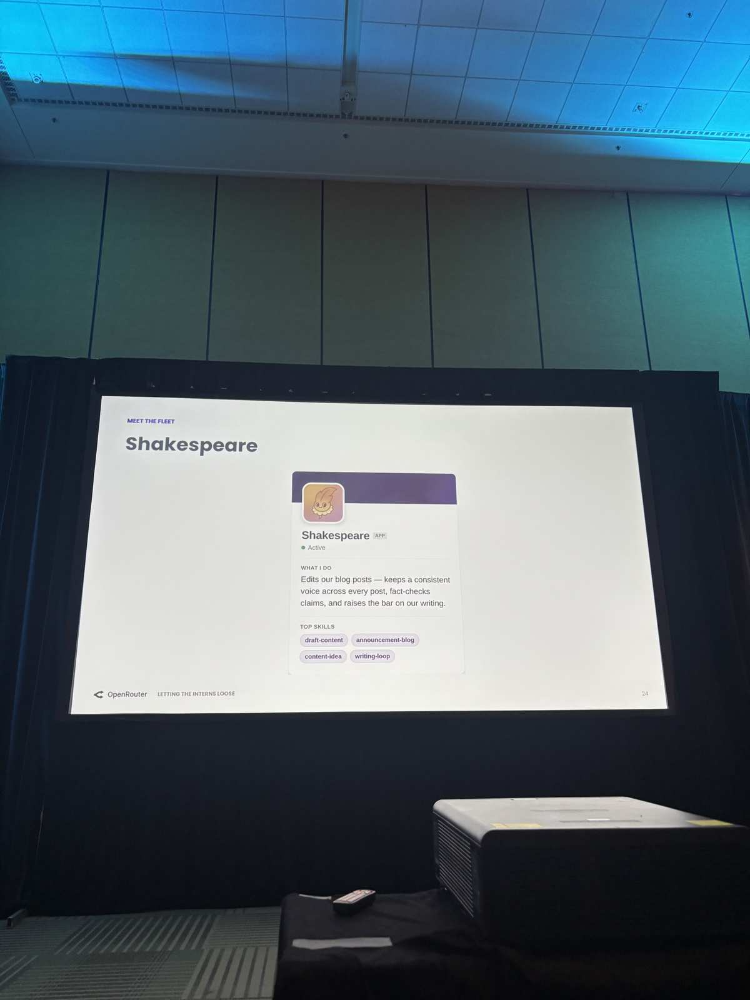

- **Active**
- **What I do:** Edits our blog posts — keeps a consistent voice across every post, fact-checks claims, and raises the bar on our writing.
- **Top skills:** `draft-content`, `announcement-blog`, `content-idea`, `writing-loop`

### eavesdropper [slide 27]

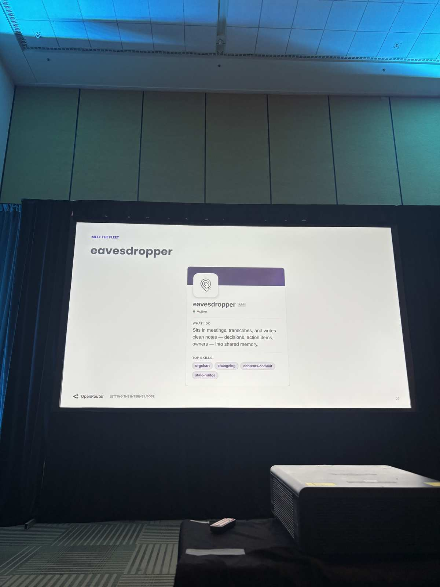

- **Active**
- **What I do:** Sits in meetings, transcribes, and writes clean notes — decisions, action items, owners — into shared memory.
- **Top skills:** `orgchart`, `changelog`, `contents-commit`, `stale-nudge`

---

## Lessons from Running This in Production

### Lessons 1/2 — "Each one is scar tissue from running this in production." [slide 32]

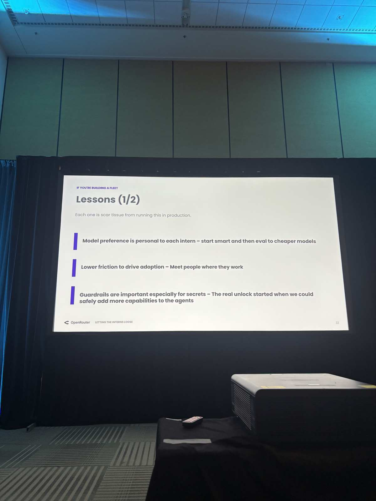
- **Model preference is personal to each intern** — start smart and then eval to cheaper models
- **Lower friction to drive adoption** — Meet people where they work
- **Guardrails are important especially for secrets** — The real unlock started when we could safely add more capabilities to the agents

### Lessons 2/2 — "Three more, for when the fleet starts to grow." [slide 33]

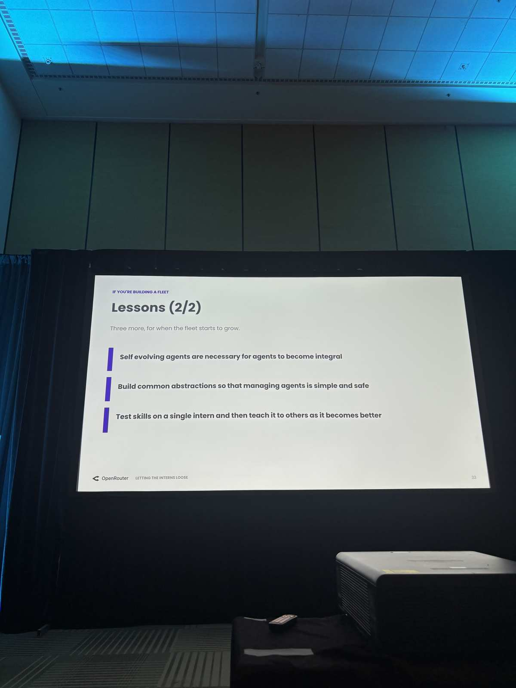
- **Self evolving agents are necessary** for agents to become integral
- **Build common abstractions** so that managing agents is simple and safe
- **Test skills on a single intern** and then teach it to others as it becomes better

---

## Notes on Coverage
Slides captured: ~14 out of ~33+ total (based on slide numbers visible). Missing: title/intro slides (~1–7), slides ~16–17, ~19, ~21–23, ~25–26, ~28–31. Speaker name not visible in captured slides — likely on the title slide. Company is clearly OpenRouter.
