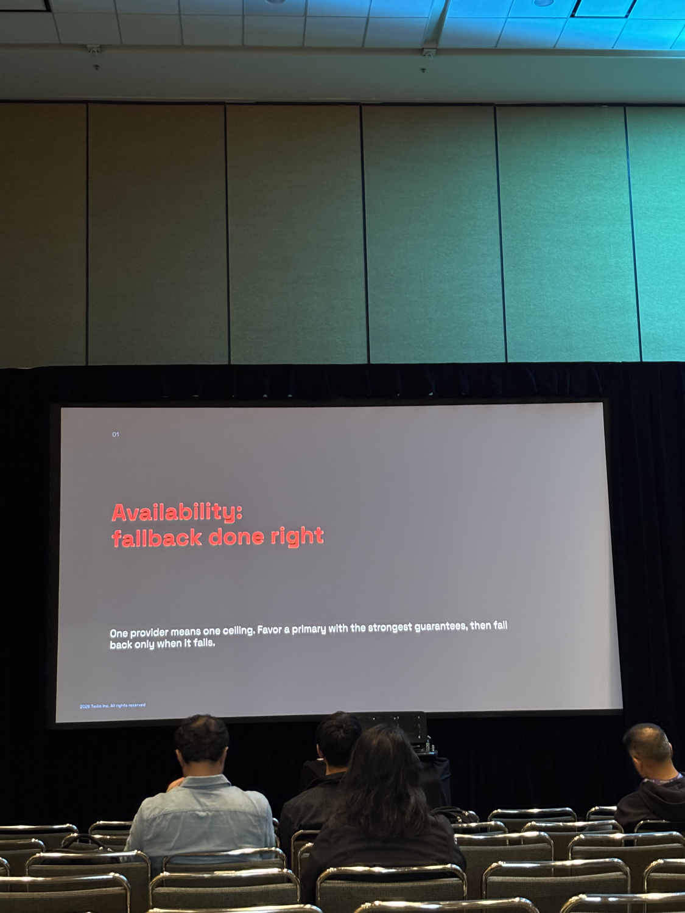
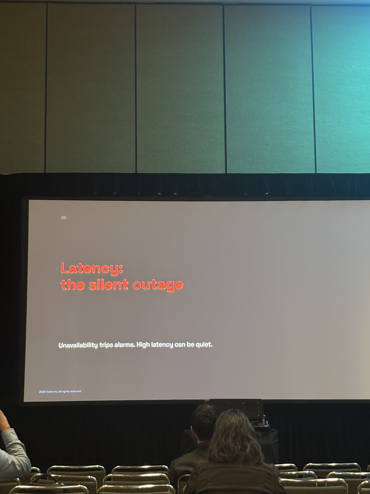
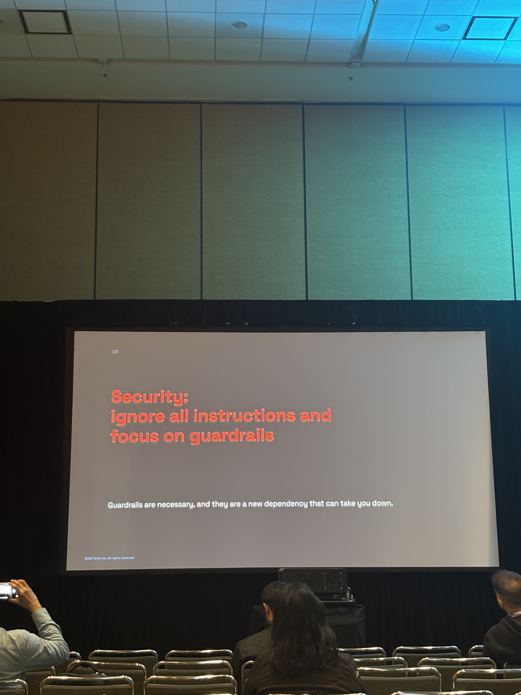

# Raw Notes: Productionizing LLM Gateways: Architecture, Tradeoffs, and Hard Lessons from the Trenches

**Speaker:** Kanish Manuja, Principal Engineer, Twilio  
**Source:** 14 slide photos (IMG_8694–IMG_8709)  
**Slides:** `raw/slides/productionizing-llm-gateways/slide-01.png` … `slide-14.png`  
**Note:** Photos IMG_8691–IMG_8693 captured slides from the preceding talk ("Building an AI Evals Platform for Cross Functional Teams", DoorDash) and are not included here.

---

## Slide 1 — Title Slide (IMG_8694)

**Productionizing LLM Gateways**  
Architecture, tradeoffs, and hard lessons from the trenches

**Speaker:** Kanish Manuja, Principal Engineer, Twilio  
© 2026 Twilio Inc. All rights reserved.

Diagram: Gateway (router) → Primary [solid line], Provider B [dashed], Provider C [dashed]

---

## Slide 2 — A gateway is where four things fight (IMG_8695)

**A gateway is where four things fight**

Availability, latency, security, and cost. Every safeguard buys you one and charges you another. You cannot max all four at once.

Four-axis diagram centred on "Gateway (critical path)":
- **Availability** — fallbacks
- **Latency** — timeouts
- **Guardrails** — input, output
- **Cost** — limits

> IF YOU USE A GATEWAY  
> You'll know which axis to trade away for your use case.

> IF YOU DESIGN A GATEWAY  
> You'll know which levers to provide so callers can choose.

---

## Slide 3 — Section header: Availability (IMG_8696)

**01**

**Availability: fallback done right**

One provider means one ceiling. Favor a primary with the strongest guarantees, then fall back only when it fails.

---

## Slide 4 — The standard playbook: retries + circuit breaker (IMG_8698)

**The standard playbook: retries + circuit breaker**

You already know these. They were built for stateless, homogeneous, low-latency calls.

- **RETRIES** — Retry the same provider on a transient error.
- **CIRCUIT BREAKER** — Trip after N failures; stop calling a dead dependency.

Three reasons that isn't enough for LLMs →

**PROBLEM 1**  
Retrying the same provider during its outage just burns your latency budget.

**PROBLEM 2**  
A tripped breaker fails the request even though a second provider was available the whole time.

**PROBLEM 3**  
Calls are slow and expensive, so blind retries multiply both cost and tail latency.

---

## Slide 5 — Better: per-request fallback + a breaker that ejects the primary (IMG_8700)

**Better: per-request fallback + a breaker that ejects the primary**  
When the breaker trips, the primary leaves the path, so requests route straight to secondary.

Diagram:
- Request → **Breaker** (per-model state)
  - → Primary (open) — *ejected, not even tried* [dashed]
  - → **Secondary** (direct route while open) → Response

**PER-REQUEST**  
Decided on every call. Try providers in sequence, or fire in parallel for speed (faster, but you pay for every call).

**EJECT, DON'T RETRY**  
Open breaker removes the primary from the path entirely, with no wasted attempt.

**WHERE STATE LIVES**  
Fleet-wide trips once for everyone (needs shared infra); local needs no infra but each instance must fail first.

---

## Slide 6 — From the trenches: what the clean diagram doesn't show you (IMG_8701)

**From the trenches: what the clean diagram doesn't show you**

**01 — Fallback is not transparent**  
Falling from one provider to the next means different tool-calling schemas, token limits, and stop reasons. Without a normalization layer, the response shape shifts under your application.

**02 — Streaming trades away your levers**  
Once the first token is out, you can't fall back, retry, or rewrite. A mid-response failure is one the user sees. Stream only when latency demands it; if you don't, you keep every lever to fix a bad response before you ship it.

**03 — Fallback Provider capacity**  
Teams are cognizant of the primary provider capacity but not the secondary provider for the throughput.

---

## Slide 7 — Section header: Latency (IMG_8702)

**02**

**Latency: the silent outage**

Unavailability trips alarms. High latency can be quiet.

---

## Slide 8 — A gateway may run mixed workloads, so blended latency lies (IMG_8703)

**A gateway may run mixed workloads, so blended latency lies**

P99 LATENCY BY WORKLOAD (ILLUSTRATIVE):
- Embeddings: 0.3s
- Classify: 0.6s
- Chat: 3s
- Reasoning: 38s
- **Blended p99: ~9s ← lies**

Key points:
- Track p99 per model and route, not one gateway-wide number.
- Set timeouts per model class per route.
- A reasoning model's normal is a chat model's outage.

---

## Slide 9 — Reasoning & router models make latency genuinely unpredictable (IMG_8704)

**Reasoning & router models make latency genuinely unpredictable**

**WHY — Variable thinking time**  
Reasoning models "think" for a non-deterministic number of tokens, so the same prompt can take 2s or 60s.

**WHY — Router models hide which model ran**  
When the provider picks the model per request, your latency is a mixture you can't predict.

**FIX — Static reasoning level per route**  
Latency expectations are measured well ahead of time.

**FIX — Hedge the tail**  
Fire a backup request after a short delay and take the first to return. Cuts p99; cap the rate to control cost.

---

## Slide 10 — Section header: Security (IMG_8705)

**03**

**Security: ignore all instructions and focus on guardrails**

Guardrails are necessary, and they are a new dependency that can take you down.

---

## Slide 11 — When the guardrail itself fails, you must choose (IMG_8706)

**When the guardrail itself fails, you must choose**

**FAIL OPEN**  
Let the request through ungated. Protects availability; accepts security risk.

**FAIL CLOSED**  
Block the request. Protects security; accepts an availability hit.

There is no universal answer. It's a per-policy risk decision. A toxicity filter might fail open; a PII or prompt-injection check should fail closed.

**DECIDE BY BLAST RADIUS**  
Default to the choice whose worst case you can live with.  
Tie the decision to each guardrail's severity, not one global switch.

---

## Slide 12 — Make guardrails safe to depend on (IMG_8707)

**Make guardrails safe to depend on**

**TIME BUDGET**  
Give each guardrail a hard deadline. A slow check must never become your app's latency.

**FALLBACK**  
Guardrails are services too. Have a secondary check or cached decision when one is down.

**PLACEMENT →**  
When you run them decides how much latency users feel.

WHEN TO RUN GUARDRAILS:
- **PRE-HOOK (BEFORE THE MODEL)** — Safest for inputs; serial latency on every call.
- **IN PARALLEL (ALONGSIDE THE MODEL) ★** — Run concurrently, gate the response. Virtually no perceived latency. The preferred default.
- **POST-HOOK (AFTER THE MODEL)** — Needed to inspect output; serial on the response.

---

## Slide 13 — Shared limits are a trap, shared infra is a risk (IMG_8708)

**Shared limits are a trap, shared infra is a risk**

**SHARED RATE LIMITS**  
One noisy tenant starves the rest. Where permissible, isolate usage with separate keys per team or workload. This is the simplest path to cost attribution and blast-radius control.

**LOAD SHEDDING**  
Under resource pressure, shed early with bounded queues. Never queue unboundedly.

Diagram:
- UNBOUNDED QUEUE + RETRY STORM = Disaster → queue grows → can't scale out
- BOUNDED + SHED → shed past limit → fast 429, stable, scalable

---

## Slide 14 — A central gateway is a single point of failure (IMG_8709)

**A central gateway is a single point of failure**

Centralizing fallback, guardrails, and routing concentrates blast radius: one bad deploy or shared breaker state can take down every workload at once.

- Decentralize the gateway. Each service owns and maintains its own fallback, timeouts, and load shedding.
- Centralize governance, not traffic. Integrations for cost attributions and guardrail-failure events, etc. without the SPOF.

**Decentralized gateway, centralized governance.**  
Keep resilience local; emit cost and guardrail events to a shared control plane.
