# Rise of the Software Factory

**Speaker:** Tereza Tizkova  
**Event:** AI Engineer World Fair, San Francisco, June 2026  
**Source:** https://www.terezatizkova.com/blog/rise-of-the-software-factory  
**Note:** Loose write-up of the talk, not an exact transcript. Images below are the actual slides.

---

## No one knows what software factory means

Everyone is launching software factories. Enterprises share their transformations, LinkedIn is full of thought leadership, and this conference even has a dedicated track for them. What is much harder to find is honest evidence that any of it works in production, or a clear answer about the conditions it needs and how autonomous software really is today. Those are the questions people actually ask when the marketing fades: what a software factory is, whether they should build their own and how, what genuinely works in production, and at what cost.

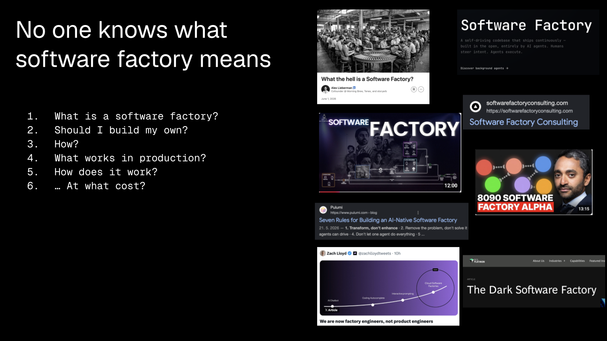

Definition: a software factory is the whole cycle of developing software that runs autonomously — far more than writing code. It covers the spec, the build, the validation, the deploy, and the learning that comes back afterward. The better mental image is not a chatbot that codes but a factory floor, with parallel lines each handling a different task at a different level of autonomy, where you set policy and priorities at the top and the floor reports back up to you.

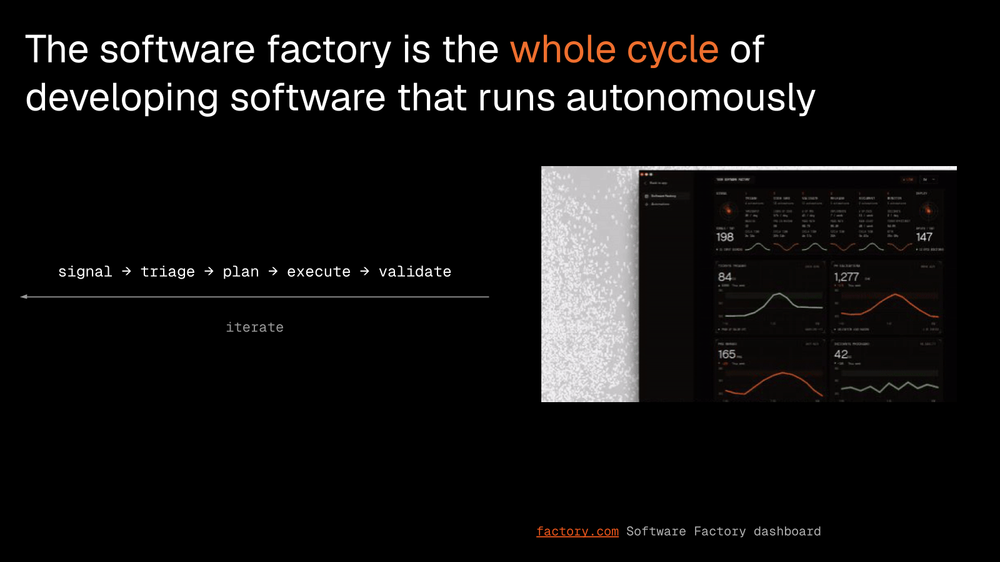

Three properties that make this floor trustworthy: **agnostic**, **autonomous**, and **always-improving**.

---

## The software factory was not possible two years ago

Technology timeline:
- 2017: Karpathy's "Software 2.0" essay — the intellectual precursor
- 2021: Copilot — autocomplete
- 2022: ChatGPT — conversation
- 2023: GPT-4 + bigger context windows — real code generation; AutoGPT and BabyAGI already looping but didn't work (models hallucinated, context too small, reasoning too weak, no good isolated environments)
- 2024: Better reasoning — multi-step tasks
- 2025: Persistent environments + long-running missions — genuine autonomy

The length of task an agent can handle doubles roughly every seven months. For years the AI was a brain with no body — able to plan, retry, and narrate but never actually execute across a full cycle.

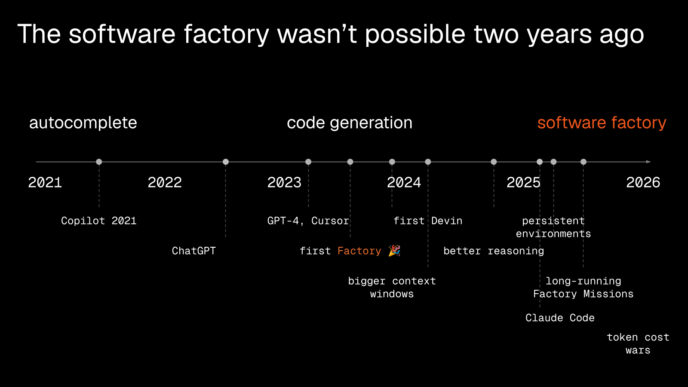

A software factory is much more than a coding agent, or even a swarm of thousands of coding agents — generating code is the easy part. Engineers spend most of their time not on writing code but on everything that surrounds it, and that surrounding work is exactly what a factory has to handle. The right mental model is building a real team of people.

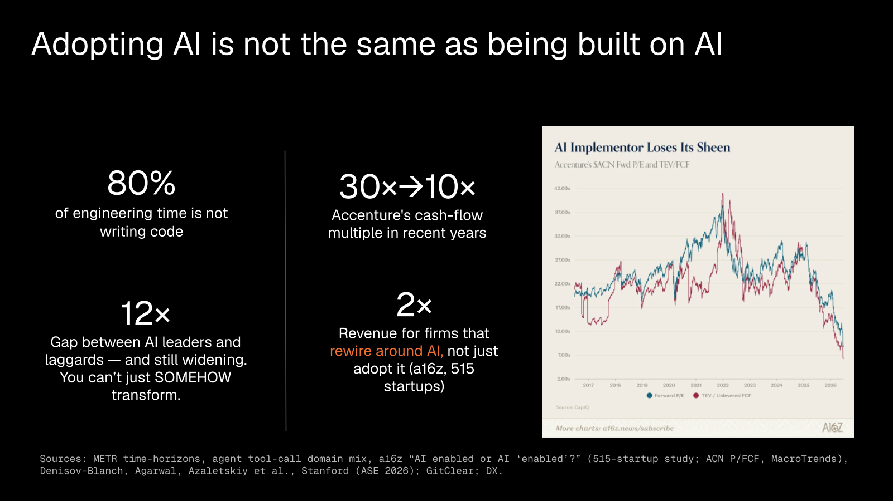

The firms that rewire their organization around AI, rather than bolting it onto their existing process, pull steadily ahead. The gap between leaders and laggards keeps widening because readiness is what compounds over time. A software factory is something you build and own, not a consultancy you hire.

Accenture's valuation multiple peaked near 30x in early 2025 and has come down to about 10x. The market is pricing the difference between advising on AI and actually shipping it.

**Electrification analogy:** When factories first got electricity, they bolted a motor onto the old steam-era layout and saw almost no gains. The real jump only came once they redesigned the whole factory around electricity. AI works the same way — bolting agents onto today's process leaves you with the old factory and a new motor. Redesigning the process around them is what produces a software factory.

That factory should:
- Stay independent instead of locking you into one platform
- Work with the models and tools you already use
- Be trusted enough to run genuinely autonomously
- Carry context so that it learns with use

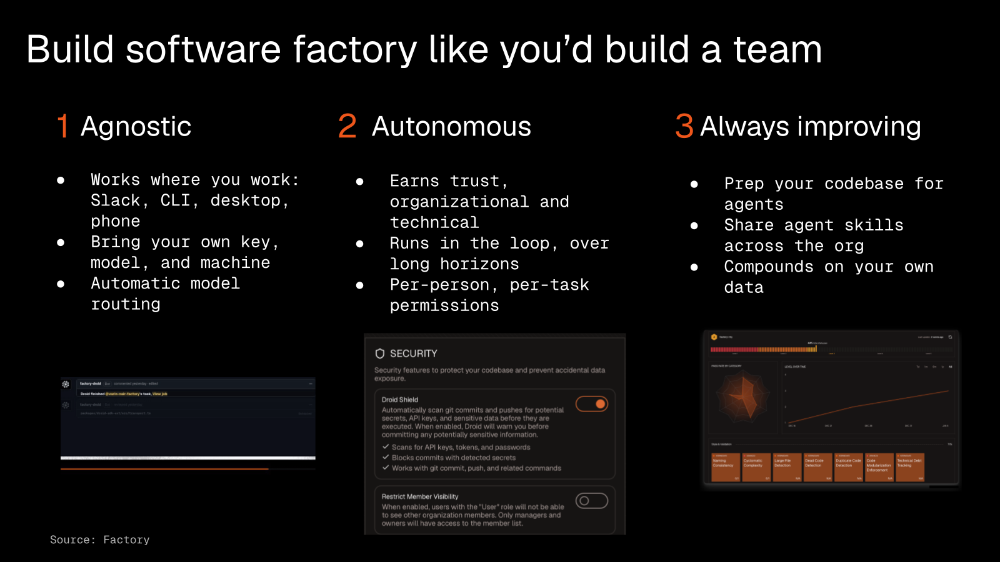

The same agent should be able to run in the cloud, locally, in CI, and in your IDE — that portability becomes real leverage and keeps you clear of vendor lock-in.

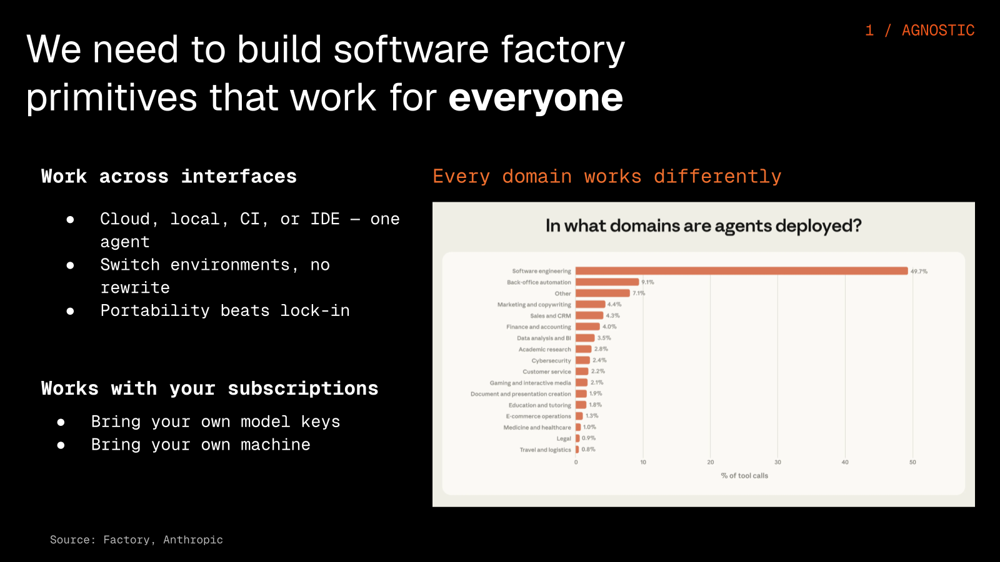

---

## 1. Agnostic

Brian Armstrong (CEO of Coinbase) shared how his team cut their AI spend significantly while still token-maxing — through better default models, routing, and caching rather than friction and spend alerts. Token usage grew exponentially while actual spend stayed flat.

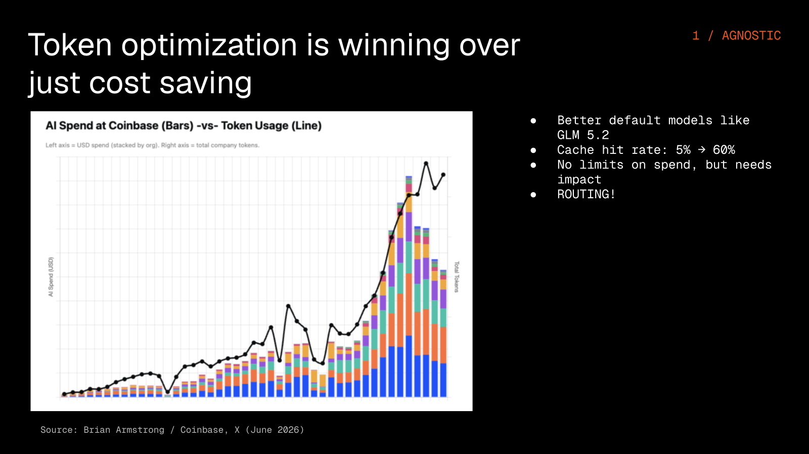

When everything gets commoditized, the smarter move is to use all of it rather than bet on a single model. Routing does more than cut cost — it buys reliability through failover between providers and speed by sending simple tasks to the fastest model, all without sacrificing quality.

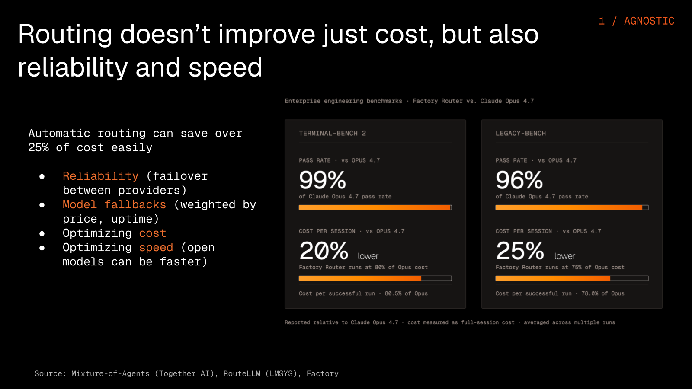

**The Factory Router:** When an engineer describes a task in plain language, the classifier reads it and scores: message content, recent tool calls, repo size, language mix, and difficulty — then assigns each model a quality-probability score and automatically picks the best fit.

Four parts:
1. Assign a task (org can set different default models/permissions per role — sales, marketing, engineers each start from a sensible default)
2. Classifier scores task difficulty
3. Set a quality threshold for what counts as good enough
4. Router picks the cheapest model predicted to clear that threshold

Benchmark shows ~25% savings (likely higher in practice).

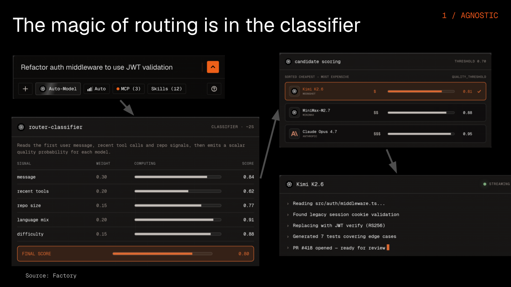

The router does not lock in its first decision — it can upgrade mid-conversation and switch to a stronger model when a task turns out harder than expected. The user always keeps an override.

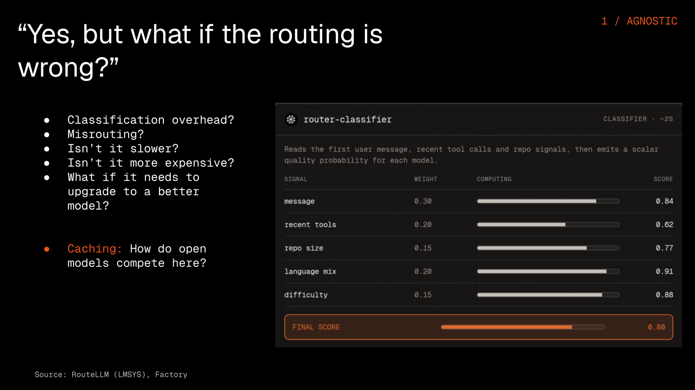

**Caching:** A transformer does not really remember your conversation — on every turn it re-reads the entire history from scratch. Prefix caching lets it skip recomputing the parts that didn't change (system prompt, tools, skills). The second turn is roughly 10x cheaper than the first. These savings are passed through to end users.

Caching is not a moat — anyone can do it, including open models on your own dedicated compute. The final price is a pricing decision, not a technical one.

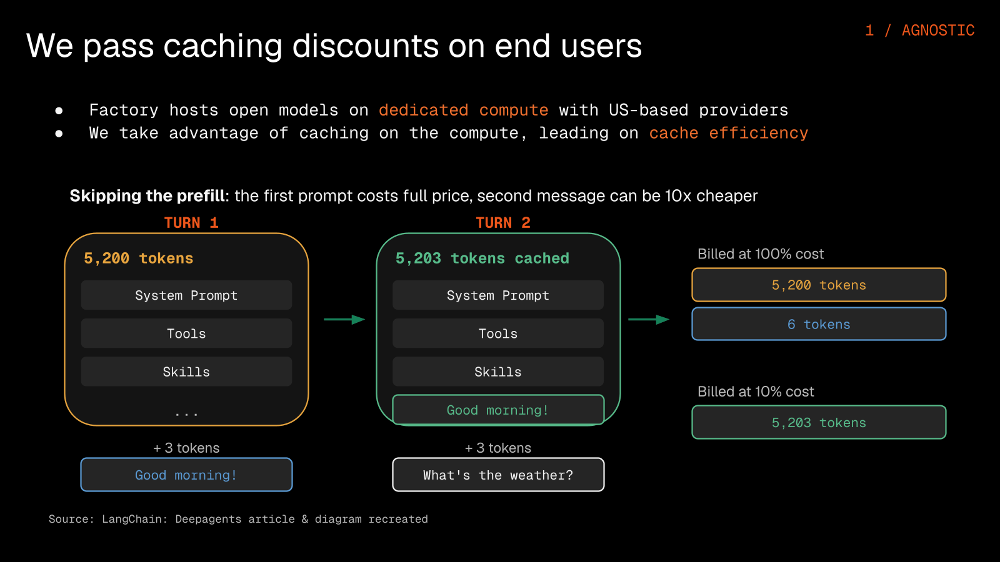

**Resources:**
- Brian Armstrong / Coinbase on X
- Factory Router: factory.ai/product/router
- Anthropic: prompt caching
- Karpathy, "Software 2.0" (2017)
- METR: Measuring AI Ability to Complete Long Tasks
- MacroTrends: Accenture P/FCF historical data

---

## 2. Autonomous

The loop never went away, it just moved up a layer. You can trace the same pattern through mathematical induction, code loops, training loops, ReAct tool loops, and now software factory loops. The core never changes: an iterator, some exits, and a set of entry conditions.

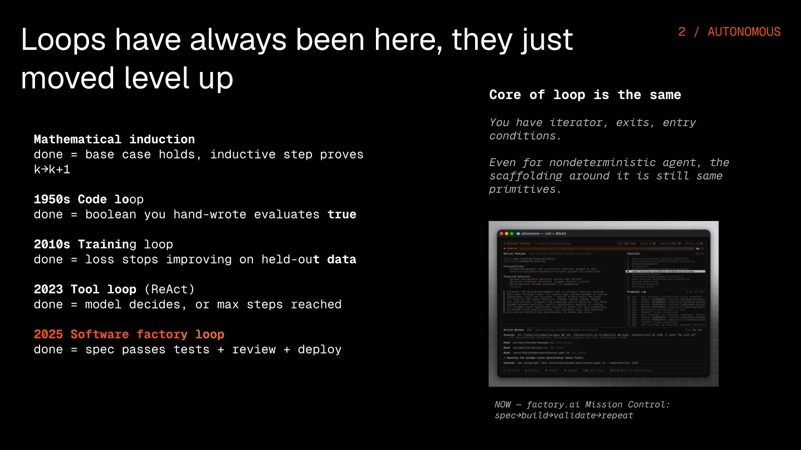

**Real example:** Someone asked Droid for a 750mm Factory rotor logo, wall-mounted, printed on their Bambu X1C. After one prompt and a single clarifying question, Droid: pulled the SVG from brand assets → converted to 3D model → sliced for the printer → output G-code. All the way through with no hand-holding.

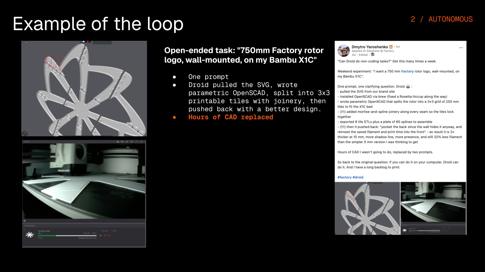

Agents will eventually run for a year without interruption. Task length doubles roughly every seven months, but only at 50% reliability. The real frontier is reliability over long horizons rather than raw capability. Capability is largely solved; reliability is where the real advantage now lives.

**Three-role architecture:** orchestrator + workers + validators, tied together by a validation contract that defines what "done" means before any code is written.
- Orchestrator: planning
- Workers: implement pieces (run in **sequence**, not parallel swarm — each finishes and hands off so the next starts with fresh context, like a colleague reviewing code with fresh eyes; a worker can still spin up its own parallel subagents for smaller jobs)
- Validators: judge the result independently

In a real customer mission, validation alone took ~40% of the whole process — that's a good sign.

One real mission stats: 16.5 hours, 185 agent runs, 63 workers, 27 validators, 778.5M tokens (744.9M were cache reads).

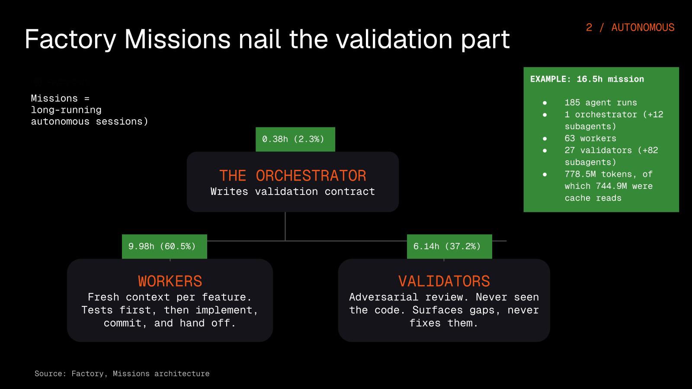

**Why separate validation from generation:** If the agent builds a feature and writes tests shaped by the same context that shaped the code, the tests will pass even if the result is wrong. That's the pattern — build a feature, write tests, watch them pass, report complete.

Two validators:
- **Scrutiny Validator**: reads the code and its trajectory, runs tests/typecheck/lint/code review. Can see the code but never wrote a line of it.
- **User-Testing Validator**: true black box — never reads source at all. Drives the running app through computer-use and checks behavior against the contract.

Real example: One engineer migrated a codebase. Other tools produced something that looked right in the code but was a dead, non-interactive dummy. The user-testing validator caught it by actually clicking through the running app. Only possible now because computer-use and persistent virtual machines for agents finally got good.

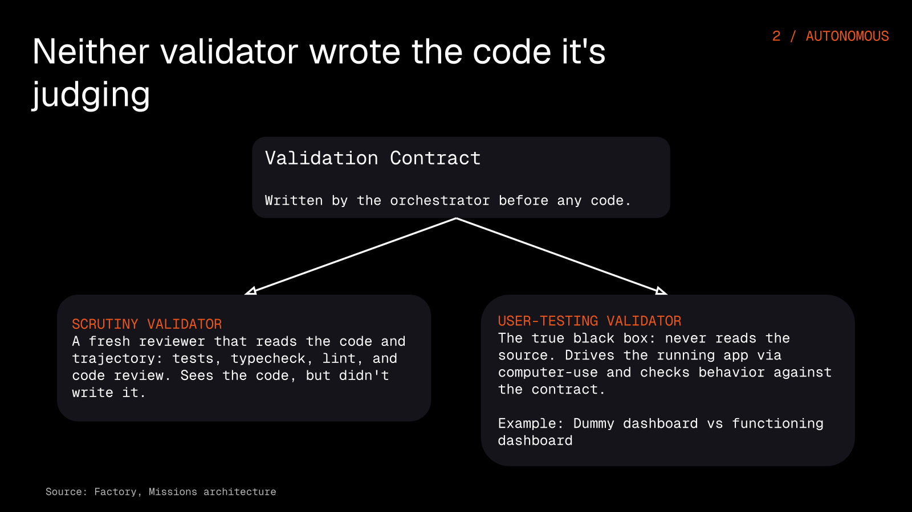

**Mission Control:** Terminal dashboard for a long-running autonomous Mission. A Droid builds and maintains a project on its own — linting, testing, implementing, committing, handing off — without anyone stepping in.

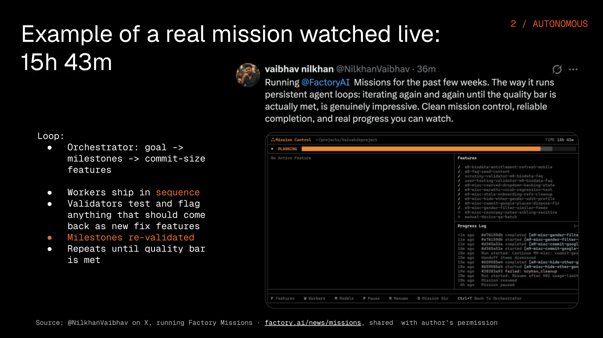

Missions run loops inside the loop. The outer loop is the mission itself (plan → implement → validate → iterate). Inner loops are individual agent sessions handling subtasks. Each worker gets fresh context per feature so it does not carry stale assumptions from one task into the next.

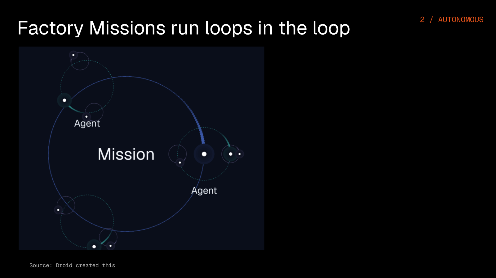

**Context is the elephant in the room.** Less bloat → fewer compressions → more reliable long-horizon runs. Enterprises wire in hundreds of tools on average (Figma, Notion, Gmail, Drive, etc.), each with its own schemas, parameters, and descriptions. Two tools that merely sound alike can make an agent pick the wrong one or blow the context window and force a compression — genuinely dangerous in the middle of a long mission.

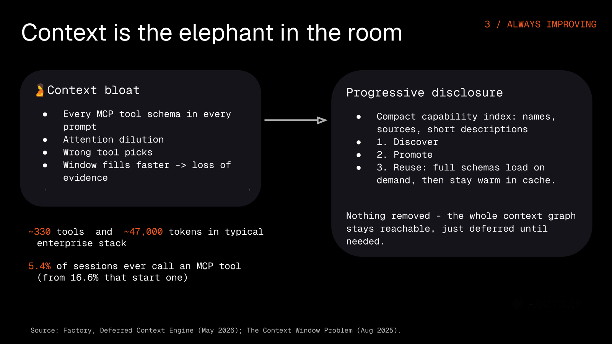

**Deferred context engine:** Keeps a compact capability index and loads full schemas only on demand. Progressively discloses tools — agent begins with a short list and short descriptions, only fully loads a tool once the code actually needs it. Nothing is ever removed, just hidden until relevant.

Results:
- ~15% cut in input tokens per MCP session on average
- ~39% at p90 (heavy sessions)
- ~51% once more than 100 tools are deferred
- Savings keep growing with catalog size

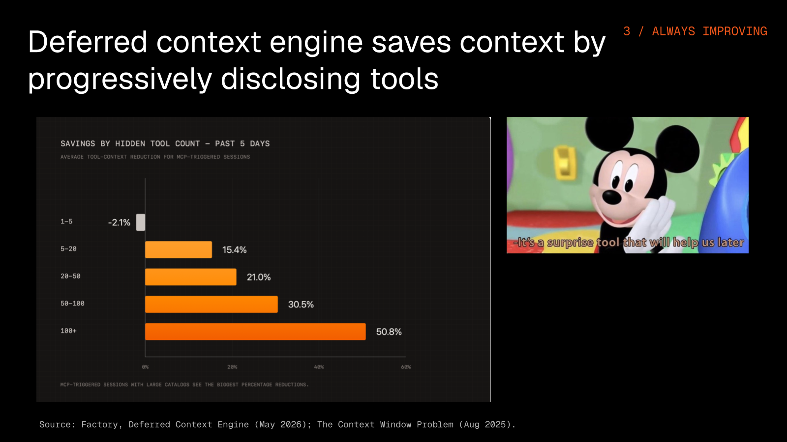

**Resources:**
- Factory: Introducing Missions — factory.ai/news/missions
- Factory: How Missions Work — factory.ai/news/missions-architecture
- Factory: Deferred Context Engine — factory.ai/news/deferred-context-engine
- METR: Measuring AI Ability to Complete Long Tasks

---

## 3. Always improving

The gap between AI leaders and laggards has run about 12x over the last three years — follows a power law where leaders take almost everything while laggards lose almost everything. No quiet middle anymore. In AI adoption you either succeed big or fail big.

Agents need onboarding the same way new engineers do. Good documentation and a legible codebase matter as much as the code itself.

GitClear and DX both show that unstructured AI coding actually degrades code quality (more churn, more duplication), while structured practice reverses that trend.

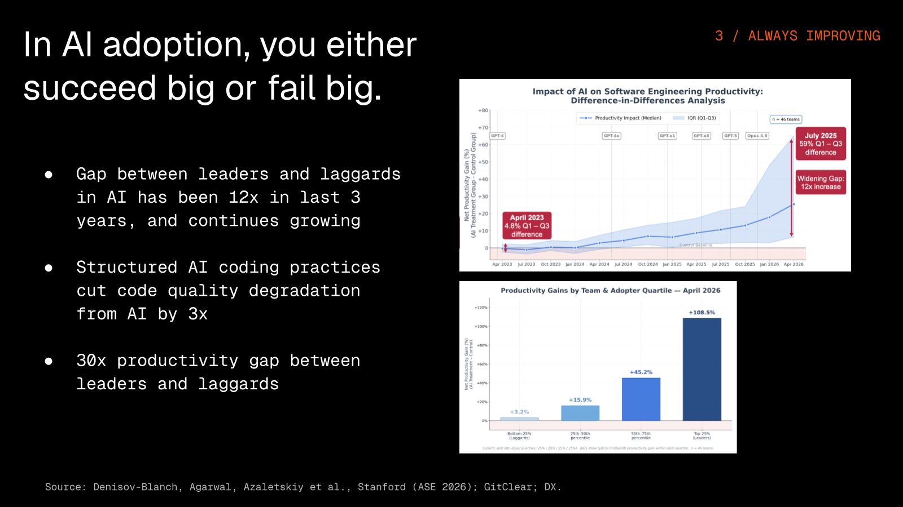

**Data pattern (repo levels):**

Level 1 repos (no linting config, no AGENTS.md, no pre-commit hooks) vs Level 2+ (basic structure):

| Metric | Level 1 | Level 2+ |
|--------|---------|----------|
| Cognitive complexity increase | +96% | +29% |
| Static-analysis warnings increase | +45% | +13% |
| Duplicated line density increase | +122% | +34% |

Gap: 3–4x across every metric. This is the strongest empirical evidence that agent results are an **environment problem, not a model problem**.

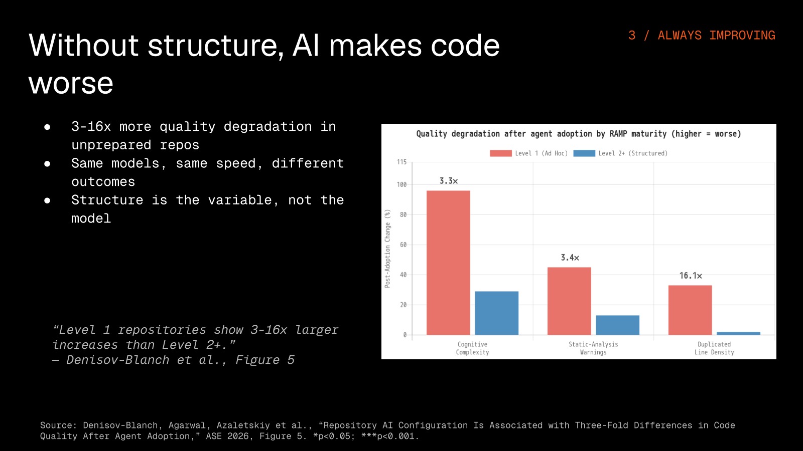

**Agent-readiness is measurable.** Score repositories on how well they support autonomous work across:
- Style and validation
- Build system
- Testing
- Documentation
- Dev environment
- Observability
- Security
- Task discovery

Teams blame the model when the real bottleneck is missing pre-commit hooks, undocumented env vars, or build steps buried in Slack.

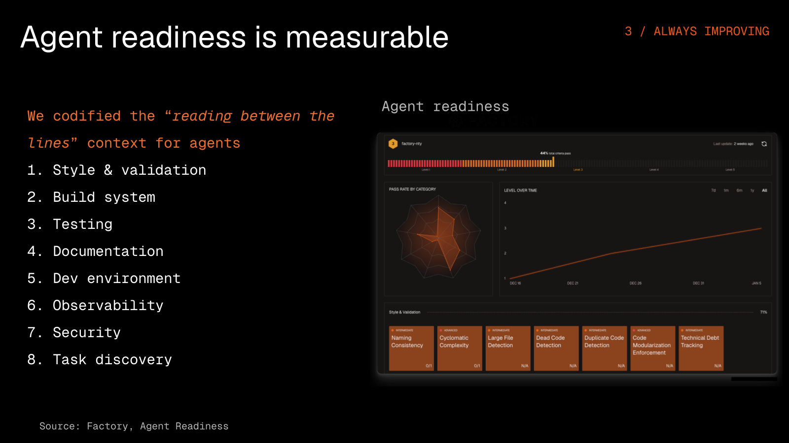

Most of the time working with AI, you find yourself repeating how you want things done — the agent still doesn't "get" you. Same problem a new hire has: every company runs on unwritten rules you only pick up by observing.

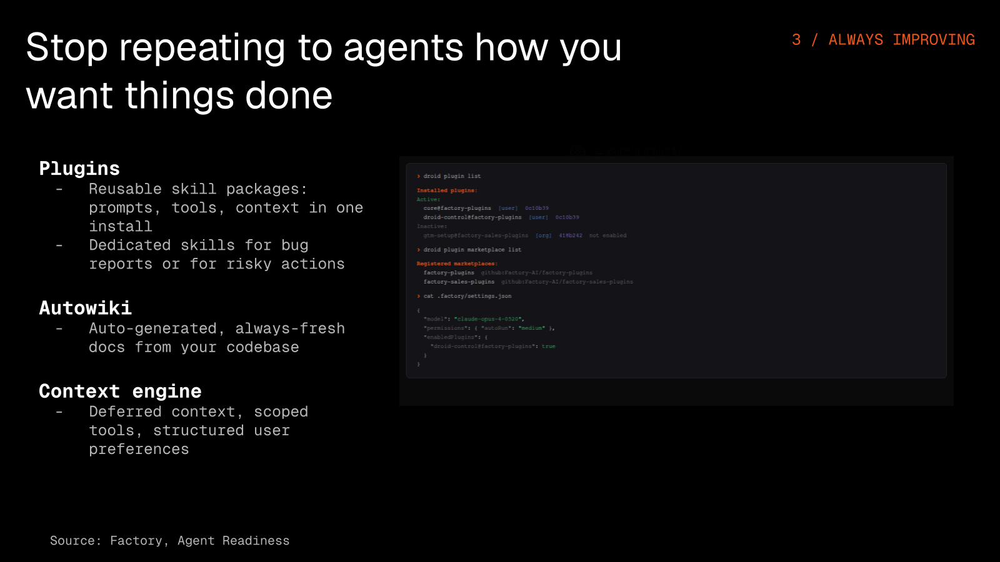

Features that encode preferences once so the agent just knows:
- **Plugins** — bundle skills, slash commands, hooks, and MCP server connections into one install. Like npm packages but for agent behavior.
- **AutoWiki** — generates always-fresh documentation from your codebase automatically.
- **Packaging layer** — ships droids, hooks, and MCP servers as versioned packages.
- **Context engine** — deferred context, scoped tools, structured user preferences.

vs. hand-configuring every developer's agent.

**Resources:**
- Yegor Denisov-Blanch, Stanford: software engineering productivity research
- GitClear: AI code quality impact study
- DX: developer experience research
- Factory: Introducing Agent Readiness — factory.ai/news/agent-readiness

---

## Where we are heading

Will the software factory replace us?

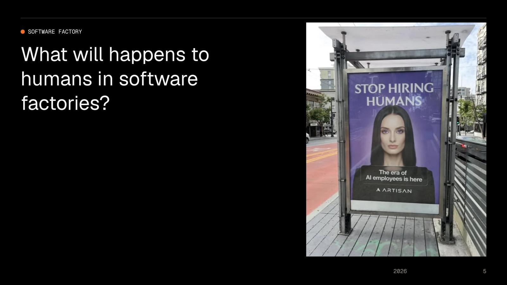

"Computer" was a job title before it was a machine. In the 1940s, more than 80 women were employed as human "computers" — a single ballistics trajectory by hand took 30–40 hours, all organized factory-style. Then compilers and high-level languages let people describe intent and stop hand-computing. The structure of the work didn't change, only the layer the humans sat at.

The software factory does not replace engineers so much as it moves what "engineering" means up a layer.

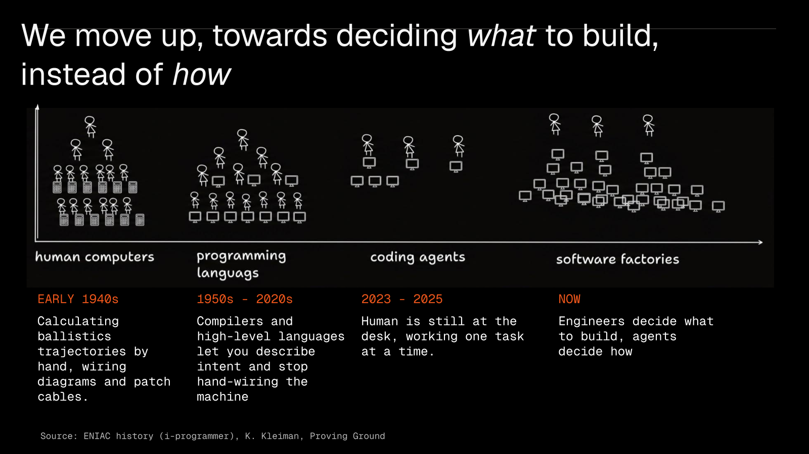

Same factory floor — but the rows of human computers are now agents. Parallel work, factory-style organization, a few humans directing. The only thing that moved is the layer the humans sit at.

The real risk is not being replaced but **refusing to move up that layer**.

Humans should be deciding **what to build** rather than **how to build it** — the how is exactly what agents are for. The factory comes for the annoying work: the alignment, the status updates, the meetings that exist only to move context between people. Hand all of that to your software factory.

"Go touch some grass and let your agents build for you."

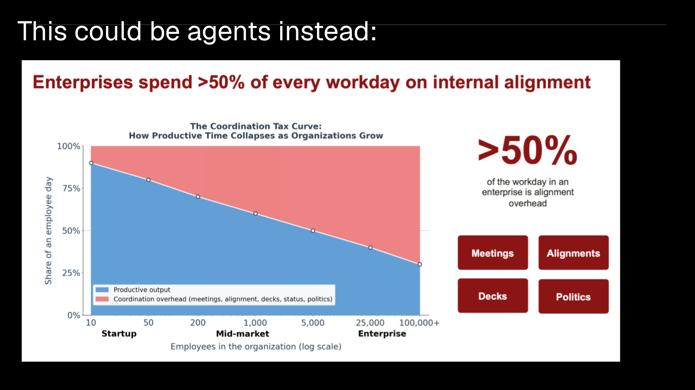

**Resources:**
- Factory.ai — factory.ai
- Factory docs — docs.factory.ai
