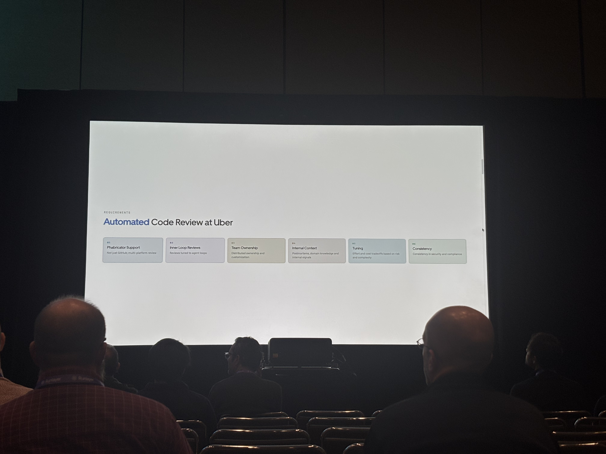
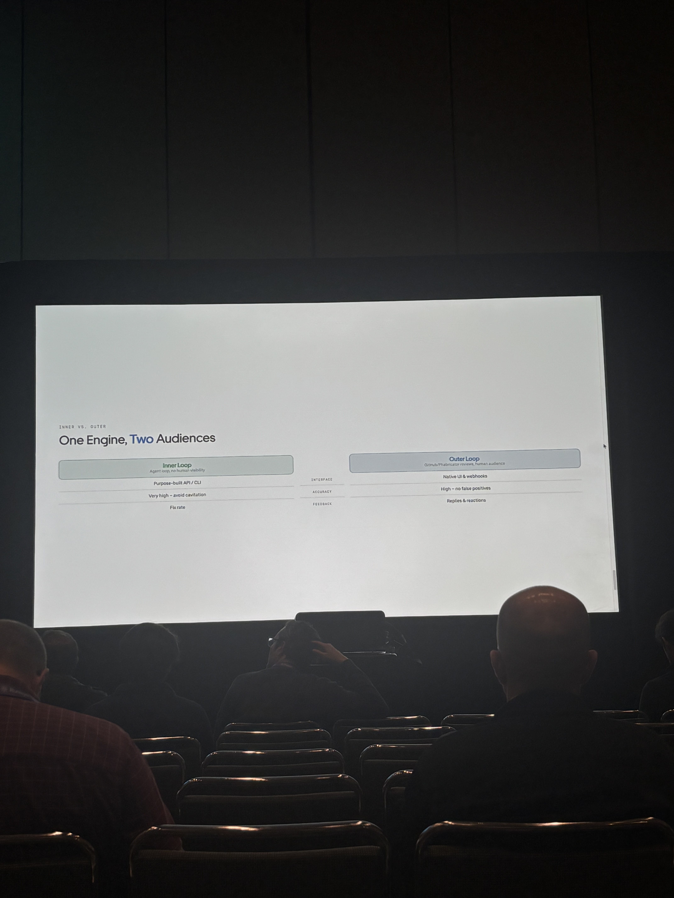

# Scaling Code Quality: Building uReview, Uber's Multi-Agent Code Review Engine

**Source:** Chang's photos of the speaker slides (4 photos, partial deck — no title slide captured). Original photos saved to [raw/slides/ureview-scaling-code-quality-uber/](slides/ureview-scaling-code-quality-uber/).

---

## Slide — Requirements: "Automated Code Review at Uber"

Six requirement cards:

1. **Phabricator Support** — Not just GitHub; multi-platform review
2. **Inner Loop Reviews** — Reviews tuned to agent loops
3. **Team Ownership** — Distributed ownership and customization
4. **Internal Context** — Postmortems, domain knowledge and internal signals
5. **Tuning** — Effort and cost tradeoffs based on risk and complexity
6. **Consistency** — Consistency in security and compliance

---

## Slide — Inner vs. Outer: "One Engine, Two Audiences"

| | Inner Loop (Agent loop, no human visibility) | Outer Loop (GitHub/Phabricator reviews, human audience) |
|---|---|---|
| Interface | Purpose-built API / CLI | Native UI & webhooks |
| Accuracy | Very high — avoid cavitation | High — no false positives |
| Feedback | Fix rate | Replies & reactions |

---

## Slide — Customization: "The Review Stack"

Three columns (Generic, Customized, Implementation), with row categories **Single File** and **Multi File** on the left.

**Generic:**
- **General Purpose** (Single File) — Bug & logic error finding via in-house, research-based prompts — *Zero-shot Prompt*
- **Deep Reviews** (Multi File) — Multi-file, in-depth review with custom, in-house, language-specific skills — *GEPA-tuned Agent Skill*

**Customized:**
- **AI Linters** (Single File) — Team-authored rules, focused on a specific concern, scoped to individual files — *Few-shot*
- **Custom Agents** (Multi File) — Domain-specific agents — team guidelines, focus areas — *Skill + Knowledge Base*

**Implementation:**
- **Ownership** — Existing system; Co-located in repos
- **Dispatch** — Deterministic routing; Risk profile, complexity
- **Observability** — Volume, cost, sentiment and addressal; Agent trajectory

---

## Slide — System Design: "uReview Architecture"

**Inputs (top row):**
- GitHub — webhook · reactions · replies
- Phabricator — webhook · reactions · replies
- Agent Loop — gRPC API

**uReview internals:**
- **Dispatch** — Review Requests, Feedback, Routing
- **Generators:**
  - Single Prompt — General, AI Linters
  - Agent — Deep Reviews, Custom Agents
  - Third-Party — (two unlabeled slots)
- **Post-Process** — Rate, Categorize, Deduplicate
- **Feedback** — Reactions · Replies · Sentiment → feeds an **Eval Dataset**, which loops back into Generators

**Loop labeling on the right side of the diagram:**
- Agent Loop (gRPC) ↔ **Inner Loop**
- GitHub / Phabricator ↔ **Outer Loop (native review)**

Both loops connect back through Dispatch → Generators → Post-Process, closing the cycle.
