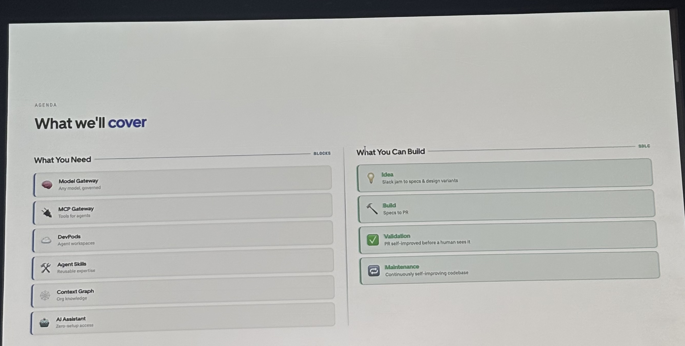

# Agentic SDLC at Uber: Building Blocks for Uber's Software Factory

## Metadata

| Field | Value |
|---|---|
| Speakers | Uday Kiran Medisetty (Distinguished Engineer, Uber), Adam Huda (Sr Engineering Leader for AI Dev Tools, Uber) |
| Day / Time | Day 2 — Session Day 1 · 11:40am–12:00pm |
| Room | Leadership 1 |
| Track | AI-Native Enterprises |
| Status | Confirmed |
| Notes coverage | **Partial.** Photos now cover slides 2–5, 7–9, 14, and 15 of a 16-slide deck: the agenda, 5 of 6 "building blocks" (Model Gateway, MCP Gateway, DevPods, Agent Skills, Context Graph), and 2 of 4 "What You Can Build" SDLC stages (Validation, Maintenance). Still missing: slide 1 (title), slide 6, slide 10 (AI Assistant), slide 11 (Idea), slides 12–13 (Build), slide 16 (closing). This page will be updated if Chang shares the rest. |
| Slide photos | Archived at `raw/slides/agentic-sdlc-at-uber/` (originals + PNG conversions used for the embeds below) |

> **Sourcing note:** the table above (speaker names/roles, day/time/room/track) and the "Official Description" and "Headline Numbers" sections below are from the AIE conference MCP database (`list_sessions` / `list_speakers`), per the standard ingest workflow — **not** from Chang's photos. Everything from "The Six Building Blocks" onward is sourced from the photographed slides; see [raw/agentic-sdlc-at-uber.md](../../raw/agentic-sdlc-at-uber.md) for the verbatim transcription.

## Official Description

_(Source: AIE MCP, not the slides.)_

99% of Uber engineers are using AI every month, 70% of PRs are attributed to AI, and 15% of PRs are now done entirely by autonomous agents. In this session, we go behind the scenes to show you exactly what it takes to get there — starting with the foundational building blocks: the model gateway, MCP infrastructure, agent skills, knowledge systems, and cloud developer environments that make agentic engineering possible at scale. Then, once those foundations are in place, we show you how to assemble them into a fully agentic SDLC. We'll walk through every stage — from research and spec writing, to autonomous code generation, to verifying and validating that code before it ships, to monitoring what happens after it lands, and continuously improving it over time. With tooling example demos throughout. Whether you're just starting your agentic journey or already running agents in production, you'll leave with a concrete blueprint for what this looks like end to end.

## Headline Numbers

_(Source: AIE MCP official description, not the slides — these stats were not shown in the 7 photos.)_

- 99% of Uber engineers use AI monthly
- 70% of PRs are AI-attributed
- 15% of PRs are done entirely by autonomous agents

## The Six Building Blocks ("What You Need")

1. **Model Gateway** — any model, governed
2. **MCP Gateway** — tools for agents
3. **DevPods** — agent workspaces
4. **Agent Skills** — reusable expertise
5. **Context Graph** — org knowledge
6. **AI Assistant** — zero-setup access *(slide not captured)*

These feed into four SDLC stages ("What You Can Build"): **Idea** (Slack jam → specs & design variants), **Build** (specs → PR), **Validation** (PR self-improved before a human sees it), **Maintenance** (continuously self-improving codebase).

## Key Claims

**Model Gateway** — solves PII leakage to third-party LLMs (teams roll their own redaction or skip it), latency cost of per-request safety checks, and scattered cost attribution. Architecture: callers (internal agent harnesses + user-facing AI products) → middleware chain (SPIFFE/SPIRE identity → data anonymizer → AI Guard → LLM cache → smart router) → management (project catalog, per-caller/per-user attribution, spend tiers) → observability (audit log, session traces, cost reconciliation) → routes to OpenAI, Anthropic, Google, or OSS models.

**MCP Gateway** — ranks four caller patterns by context cost: Direct MCP ($$$$, N tool schemas in context) → Omni MCP ($$$, one MCP that discovers/calls any server) → `aifx mcp call` ($$, CLI wrapper, JSON out, zero context cost) → Code Mode ($, skills that call MCP CLIs and parse output automatically). The gateway itself handles auth → discovery → schema → route → execute, plus rate limiting, a registry, and a playground. Fronts both 1P servers (Code, Phabricator, QueryRunner, Flipt) and 3P servers (Glean, Slack, Google Workspace, GitHub).

**DevPods** — solves "agents can't run on laptops," slow environment setup (cloning a monorepo + deps + indexing takes minutes), and language silos that fragment cross-repo agent work. 14K+ DevPods running at peak with ~seconds startup time, achieved via balloon pods, a warm pool, a snapshot store, and pre-indexed code. Supports mobile simulation (iOS/Android emulators), unified "mega" environments spanning Go/Java/Web/Data/iOS/Android, and runs across 5 GKE regions (Oregon, Virginia, Netherlands, São Paulo, Mumbai).

**Agent Skills** — solves duplicated skill-building across teams and non-portable skill config (Claude Code, Codex, Cursor, OpenCode each need separate setup). Skills are defined once (`SKILL.md` with name/description/allowed-tools) and distributed via `aifx plugin add` to all harnesses. 2.5K+ skills, 20K+ executions/day: 450+ built by a core team (17 categories) and 2,000+ by domain teams across 94 orgs. Every skill passes a quality gate (14 lint checks → 120-point eval → model gate) before landing in the catalog, with a feedback loop (OTel traces + review comments → eval reruns + SKILL.md patches) closing the loop on quality.

**Context Graph** — solves agents "guessing" without visible relationships, context scattered across 30+ systems, and the token/latency cost of fan-out tool calls to assemble connected context. 40M+ nodes and edges across 150+ node/edge types (Engineer, Team, Service, Repository, Incident, Feature Flag, Dataset, etc.), built from 30+ data sources (asset registry, code review, issue tracker, incident mgmt, CI/CD, and more). Demo: the same natural-language question ("What % of Mobility trips in India use Cash?") took 8 tool calls / 44s / $0.38 with the graph vs. 94 tool calls / 627s / $2.75 without — a 14x time and 7x cost difference for the identical correct answer.

**Validation** — "Every PR self-improves before a human sees it." Uber shifted validation left: an inner loop (scoped AI code review, frontend visual validation ↔ backend service integration) runs continuously, and an outer loop (self-healing CI, agentic code review via reasoning + skills) runs before a PR reaches a human. Key learning: the agent doesn't just flag issues, it fixes them, and every check/screenshot/review result is attached to the PR as evidence before a human opens it — "trust comes from evidence." Powered by Model Gateway, MCP Gateway, Agent Skills, Context Graph, and Simulators & Emulators. (Note: the demo mockup shown was explicitly labeled "illustrative — tooling UI reconstructed for demo," not a live screenshot.)

**Maintenance** — "The codebase that maintains itself." Scheduled maintenance loops run at three cadences: weekly (skill runs → PR → CI → review → land), biweekly (review comments → skill improves), monthly (incidents + bugs → new skills created). Key learning: automatic maintenance doesn't add engineering effort, it enables running more variants/experiments for the same effort, and review comments become training data that compounds the loop over time. The demo showed a "skill marketplace" for enrolling maintenance skills (e.g. `dead-code-cleanup`, `feature-flag-cleanup`, `build-graph-pruning`) that run off-peak and open PRs for review. (Same "illustrative" caveat as Validation applies to this mockup.)

## Notable Quotes

> "Graph finds the table instantly.
> Without it: 93 Bash calls exploring..." — on-slide annotation, Context Graph demo (slide 9). Note the "93" here doesn't exactly match the "94 tool calls" figure in the same slide's comparison table above — both are transcribed as they literally appear; not reconciled.

## My Reactions

*(open — share your takeaways and I'll fold them in)*

## Links

- [Uday Kiran Medisetty](../speakers/uday-kiran-medisetty.md)
- [Adam Huda](../speakers/adam-huda.md)
- Concepts: [Model Gateway](../concepts/model-gateway.md) · [MCP Gateway](../concepts/mcp-gateway.md) · [DevPods](../concepts/devpods.md) · [Agent Skills](../concepts/agent-skills.md) · [Context Graph](../concepts/context-graph.md)
- Raw note: [raw/agentic-sdlc-at-uber.md](../../raw/agentic-sdlc-at-uber.md)
- Slide photos: [raw/slides/agentic-sdlc-at-uber/](../../raw/slides/agentic-sdlc-at-uber/)
