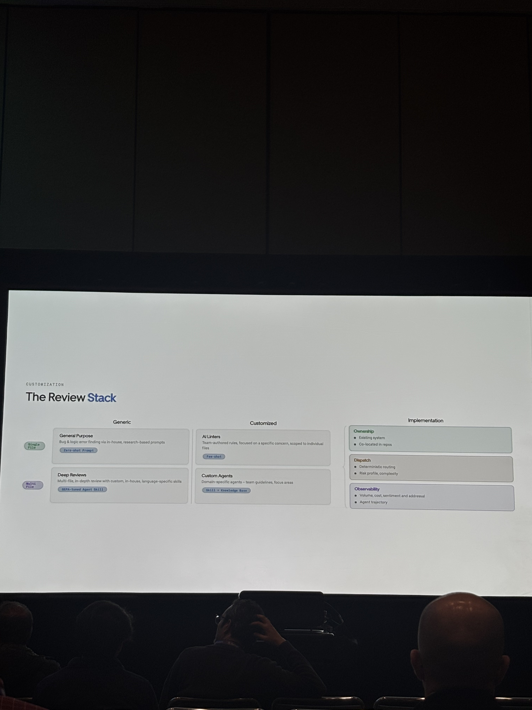
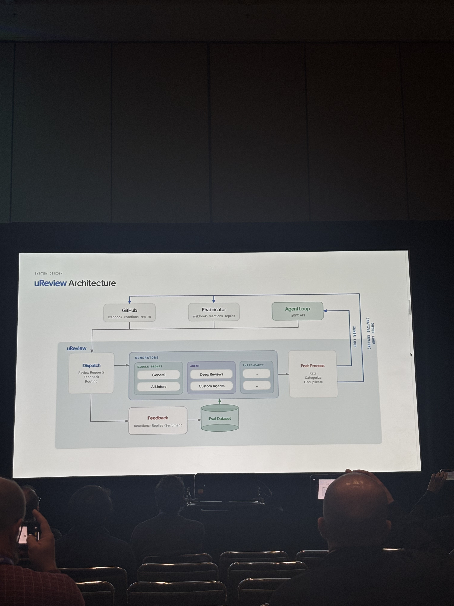

# Scaling Code Quality: Building uReview, Uber's Multi-Agent Code Review Engine

## Metadata

| Field | Value |
|---|---|
| Speakers | Will Bond (Staff Software Engineer, Uber), Ameya Ketkar (Software Engineer, Uber — Programming Systems Group) |
| Day / Time | Day 2 — Session Day 1 · 12:05pm–12:25pm |
| Room | Leadership 1 |
| Track | AI-Native Enterprises |
| Status | Confirmed |
| Notes coverage | 4 slide photos: Requirements, Inner/Outer Loop split, The Review Stack, uReview Architecture. No title slide or the Generator-Verifier/trust-layer slides described in the official abstract were captured. |

> **Sourcing note:** the table above (speaker names/roles, day/time/room/track) and the "Official Description" section below are from the AIE conference MCP database (`list_sessions` / `list_speakers`) — **not** from Chang's photos. "Requirements," "Inner vs. Outer Loop," "The Review Stack," and "uReview Architecture" are sourced from the photographed slides; see [raw/ureview-scaling-code-quality-uber.md](../../raw/ureview-scaling-code-quality-uber.md) for the verbatim transcription.

## Official Description

_(Source: AIE MCP, not the slides. Included here because it covers ground — the Generator-Verifier pattern, confidence scoring, semantic deduplication, telemetry loop — that the 4 captured slides don't show directly.)_

At Uber scale, human-only code reviews create bottlenecks, while generic AI tools overwhelm developers with noisy, hallucinated spam. uReview is Uber's multi-agent AI code review engine, built as a modular pipeline: deep contextual ingestion (beyond a raw git diff — surrounding functions, upstream dependencies, class hierarchies, Bazel dependency graphs, static linters), specialized domain agents (e.g. a Go Concurrency Analyzer, a Java Memory Leak Detector, a Security Vulnerability Scanner) instead of one generalist model, and a **Generator-Verifier** grader architecture: a primary agent generates suggestions, a secondary high-reasoning model audits them against coding guidelines before they reach the PR. Every comment gets a numerical confidence score; below-threshold comments are silently suppressed. Overlapping warnings (e.g. a static analyzer and an LLM agent both flagging the same null pointer) are semantically deduplicated into one comment. Feedback loop: Useful/Not Useful buttons on every comment feed a data lake driving continuous refinement. Success is measured by **Actionability Rate** (% of AI comments accepted as commits) and reduction in **Mean Time To Merge**, not raw comment volume.

## The Six Requirements ("Automated Code Review at Uber")

1. **Phabricator Support** — not just GitHub; multi-platform review
2. **Inner Loop Reviews** — reviews tuned to agent loops
3. **Team Ownership** — distributed ownership and customization
4. **Internal Context** — postmortems, domain knowledge, internal signals
5. **Tuning** — effort/cost tradeoffs based on risk and complexity
6. **Consistency** — consistency in security and compliance

## Key Claims

**One engine, two audiences.** uReview splits its output by consumer, not by generator: the **Inner Loop** serves agents (no human visibility, purpose-built API/CLI, feedback measured by fix rate, accuracy bar is "very high") and the **Outer Loop** serves humans (native UI + webhooks on GitHub/Phabricator, feedback measured by replies & reactions, accuracy bar is "no false positives"). Same underlying engine, different interface and different tolerance for noise depending on who's reading the output.

**The Review Stack** is organized on two axes — generic vs. customized, and single-file vs. multi-file:

| | Generic | Customized |
|---|---|---|
| Single File | **General Purpose** — bug & logic error finding via in-house, research-based prompts (zero-shot prompt) | **AI Linters** — team-authored rules scoped to individual files, focused on a specific concern (few-shot) |
| Multi File | **Deep Reviews** — multi-file, in-depth review via custom, in-house, language-specific skills (GEPA-tuned agent skill) | **Custom Agents** — domain-specific agents built on team guidelines and focus areas (skill + knowledge base) |

Implementation sits on three legs: **Ownership** (existing system, co-located in repos — teams own their own rules where the code lives), **Dispatch** (deterministic routing by risk profile and complexity, not a model deciding what to check), **Observability** (volume, cost, sentiment, addressal rate, and agent trajectory).

**uReview Architecture.** GitHub, Phabricator, and an Agent Loop (gRPC API) all feed into a central **Dispatch** stage (review requests, feedback, routing), which routes to **Generators**: Single Prompt (General, AI Linters), Agent (Deep Reviews, Custom Agents), and Third-Party (unlabeled slots on the slide). Generator output passes through **Post-Process** (rate, categorize, deduplicate) before returning to GitHub/Phabricator (Outer Loop, native review) or the Agent Loop (Inner Loop). A parallel **Feedback** path (reactions, replies, sentiment) writes into an **Eval Dataset** that loops back into the Generators — the mechanism that presumably drives the confidence-scoring and continuous-refinement behavior described in the official abstract, though the slides don't show that connection explicitly.

## My Reactions

*(open — share your takeaways and I'll fold them in)*

## Links

- [Will Bond](../speakers/will-bond.md)
- [Ameya Ketkar](../speakers/ameya-ketkar.md)
- Concepts: [AI Code Review](../concepts/ai-code-review.md)
- Raw note: [raw/ureview-scaling-code-quality-uber.md](../../raw/ureview-scaling-code-quality-uber.md)
- Original slide photos: [raw/slides/ureview-scaling-code-quality-uber/](../../raw/slides/ureview-scaling-code-quality-uber/)
