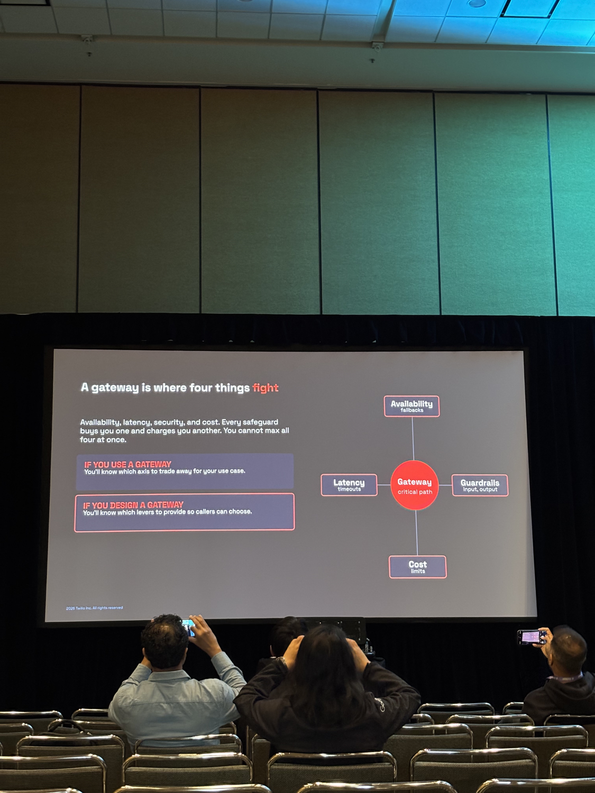
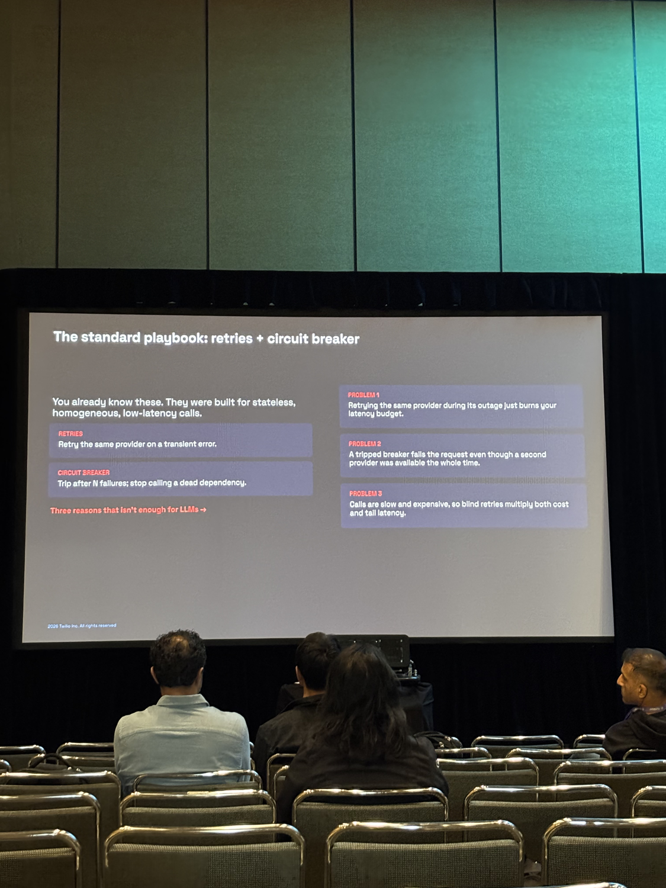
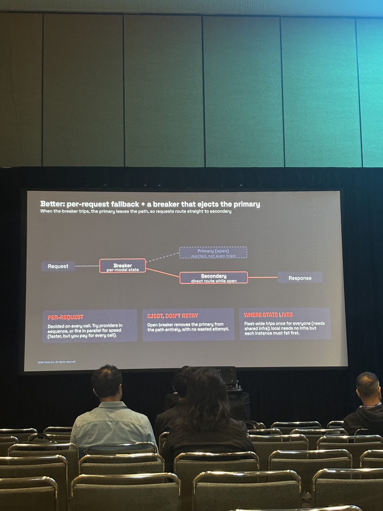
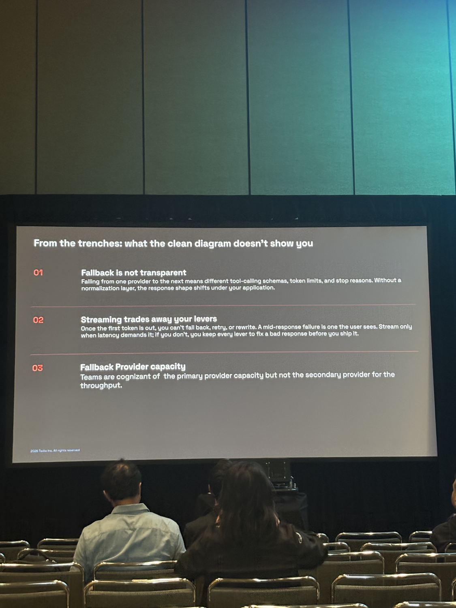
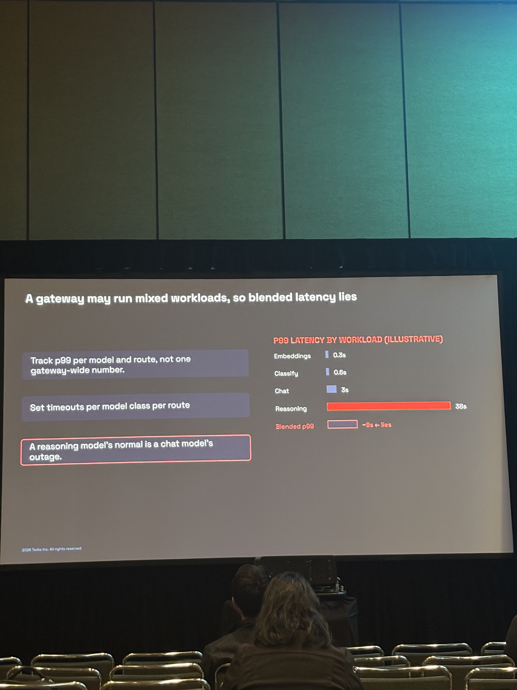
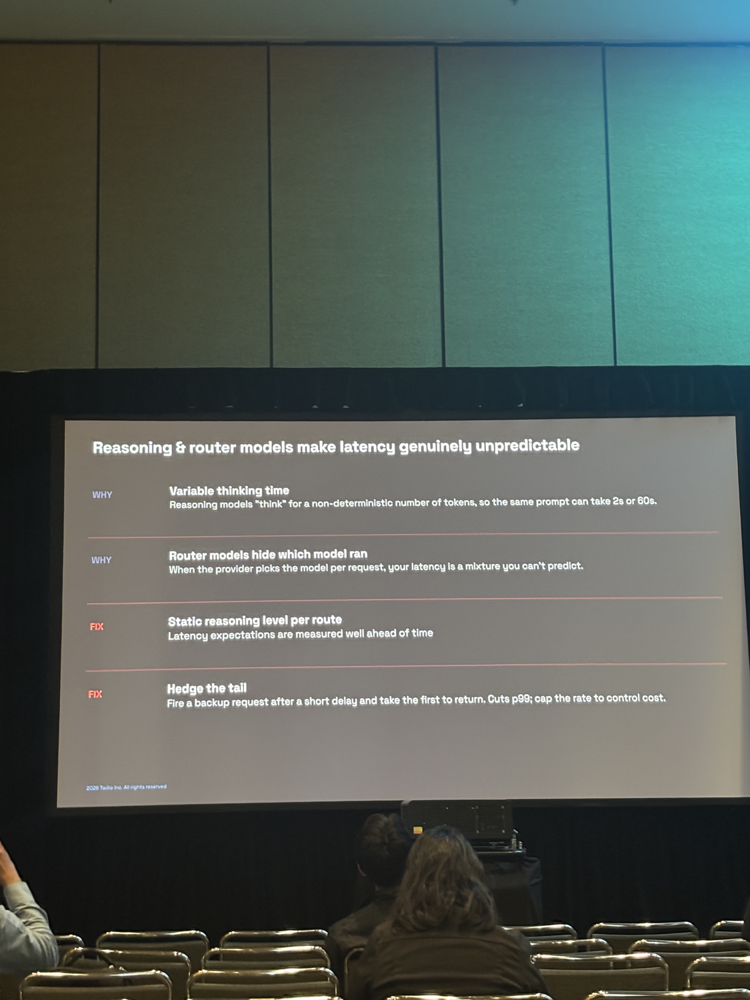
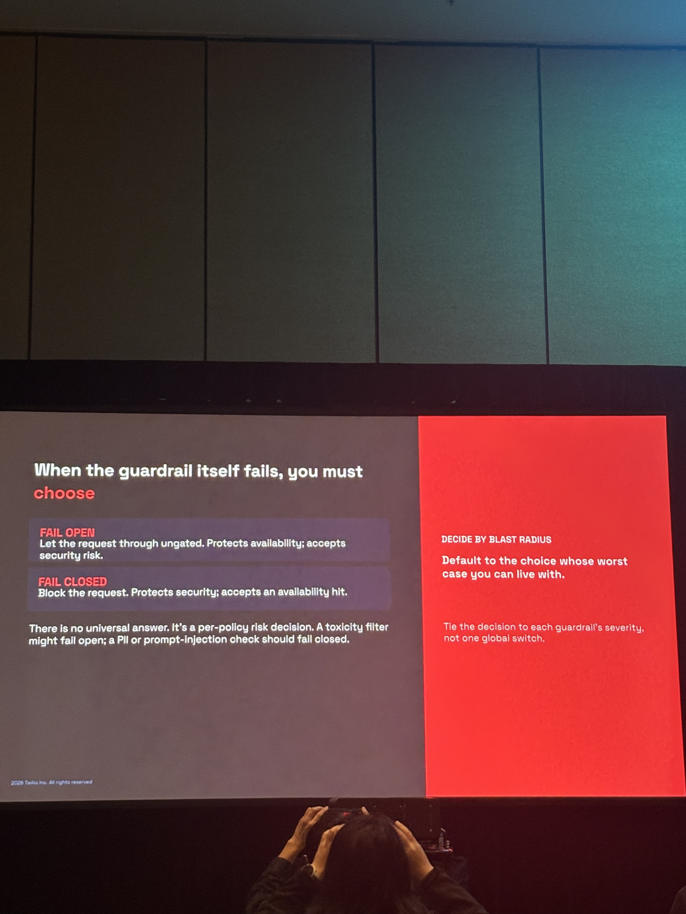
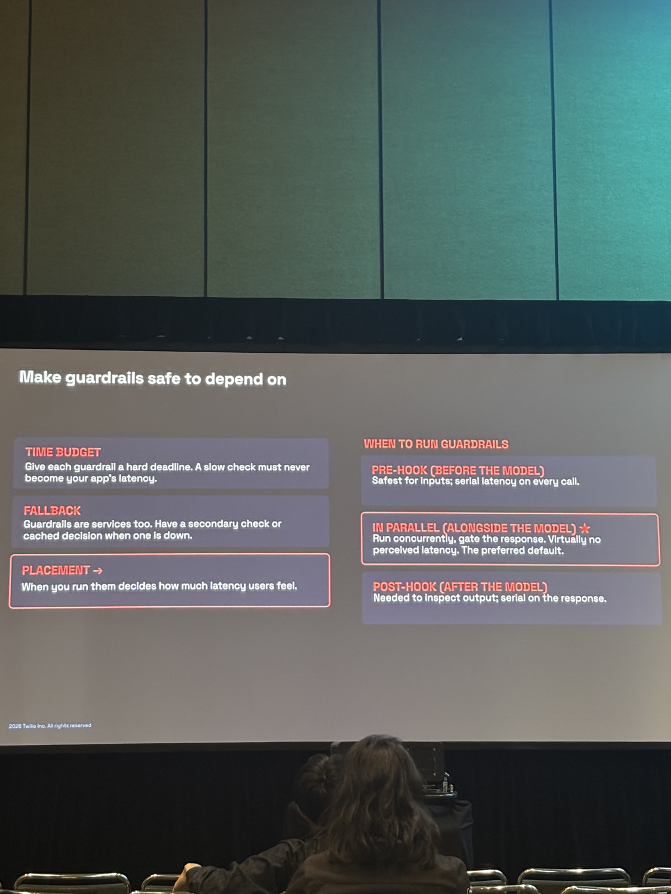
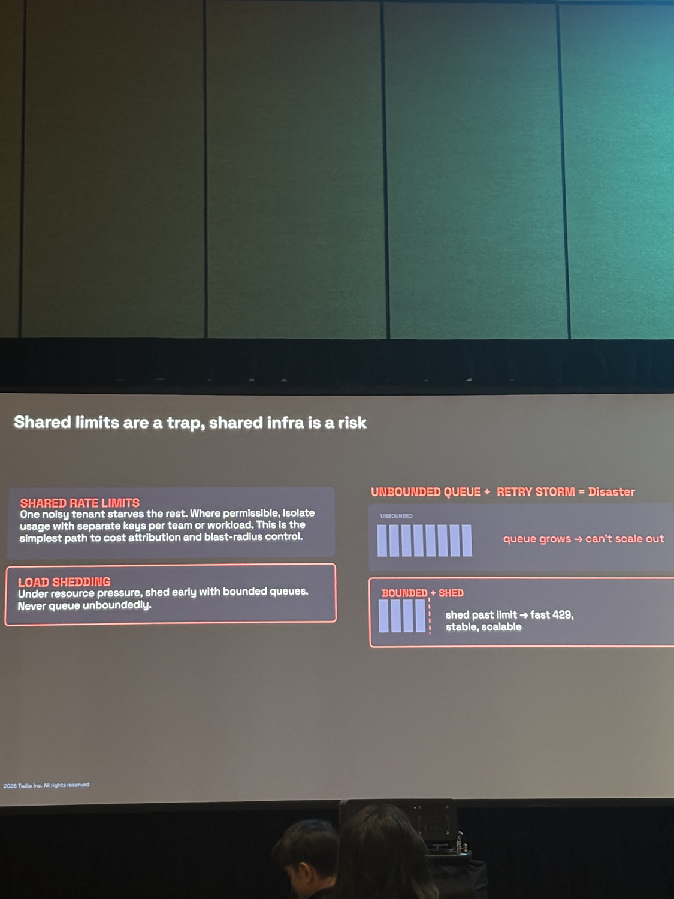
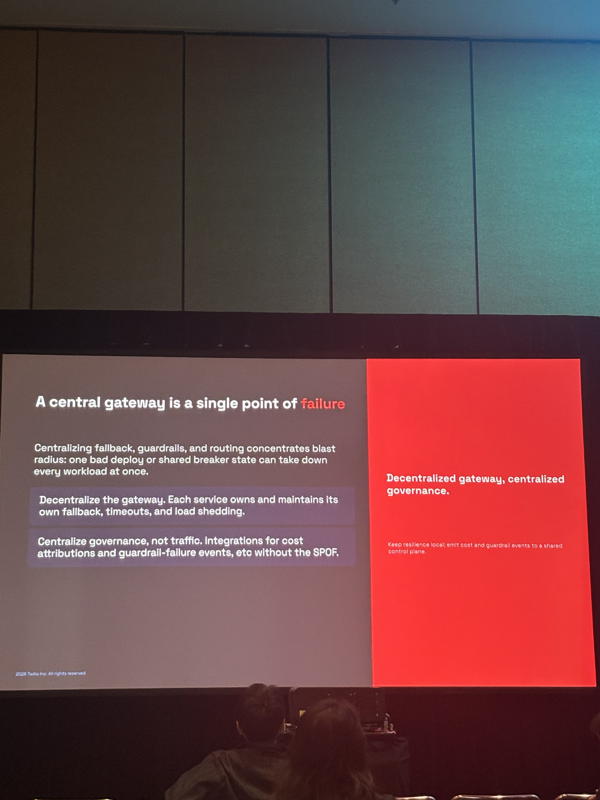

# Productionizing LLM Gateways: Architecture, Tradeoffs, and Hard Lessons from the Trenches

## Metadata

| Field | Value |
|-------|-------|
| **Speaker** | [Kanish Manuja](../speakers/kanish-manuja.md) |
| **Affiliation** | Twilio Inc. |
| **Day / Time** | Day 2 · 2:25–2:45pm |
| **Room** | Leadership 1 |
| **Track** | AI-Native Enterprises |
| **Status** | Confirmed |

**Official description:** As organizations scale their use of large language models, the biggest challenge is no longer prompting, it's productionizing. This session dives deep into building and operating an LLM gateway that sits between applications and model providers, handling routing, observability, cost control, reliability, and safety at scale. Drawing from real-world experience, this talk breaks down the architecture of a production LLM gateway, including model abstraction layers, request orchestration, fallback strategies, caching, rate limiting, and evaluation pipelines. We'll explore hard tradeoffs such as latency vs. cost, quality vs. determinism, and vendor lock-in vs. flexibility.

**Notes coverage:** 14 slides captured (full deck). Caching and evaluation pipelines mentioned in the abstract do not appear in the captured slides — likely covered in sections not photographed or discussed verbally.

**Raw notes:** [productionizing-llm-gateways.md](../../raw/productionizing-llm-gateways.md)

---

## Core Framing

A gateway sits on the critical path between callers and model providers. It is where four forces fight:

- **Availability** — fallbacks
- **Latency** — timeouts
- **Guardrails** — input/output safety
- **Cost** — limits

Every safeguard buys you one axis and charges you another. You cannot max all four at once. The talk is organised around these four axes.

---

## Section 01 — Availability: Fallback Done Right

**Theme:** One provider means one ceiling. Favour a primary with the strongest guarantees, then fall back only when it fails.

### Why the standard playbook fails for LLMs

Retries and circuit breakers were built for stateless, homogeneous, low-latency services. Three reasons they fall short for LLMs:

1. Retrying the same provider during its outage just burns your latency budget.
2. A tripped breaker fails the request even though a second provider was available the whole time.
3. LLM calls are slow and expensive, so blind retries multiply both cost and tail latency.

### Better: per-request fallback + a breaker that ejects the primary

When the breaker trips, the primary is removed from the path entirely — requests route straight to secondary with no wasted attempt.

Three design decisions:

- **Per-request:** Providers tried in sequence, or fired in parallel for speed (parallel costs more per call).
- **Eject, don't retry:** The open breaker removes the primary from the path, no wasted attempt.
- **Where state lives:** Fleet-wide state trips once for everyone (needs shared infra). Local state needs no infra but each instance must fail individually first.

### From the trenches: what the clean diagram doesn't show

1. **Fallback is not transparent.** Providers differ in tool-calling schemas, token limits, and stop reasons. Without a normalisation layer, the response shape shifts under your application on every fallback.
2. **Streaming trades away your levers.** Once the first token is out, you can't fall back, retry, or rewrite. A mid-response failure is a user-visible one. Stream only when latency demands it.
3. **Fallback provider capacity.** Teams track primary provider throughput but not the secondary's. This creates a blind spot: the fallback may be undersized for sustained load.

---

## Section 02 — Latency: The Silent Outage

**Theme:** Unavailability trips alarms. High latency can be quiet.

### Blended p99 lies

A gateway running mixed workloads produces a single latency number that lies. Illustrative p99 by workload type:

| Workload | p99 |
|----------|-----|
| Embeddings | 0.3s |
| Classify | 0.6s |
| Chat | 3s |
| Reasoning | 38s |
| **Blended p99** | **~9s ← lies** |

A blended ~9s masks the fact that chat is already in outage territory if it takes 9s, and reasoning is healthy at 38s.

Fix: track p99 per model and route, not one gateway-wide number. Set timeouts per model class per route.

> A reasoning model's normal is a chat model's outage.

### Reasoning and router models make latency genuinely unpredictable

Two structural causes:

- **Variable thinking time:** Reasoning models run for a non-deterministic number of tokens. The same prompt can take 2s or 60s.
- **Router models hide which model ran:** When the provider selects the model per request, your observed latency is an unmeasurable mixture.

Two fixes:

- **Static reasoning level per route:** Pin the reasoning budget per route so expectations are stable and measurable.
- **Hedge the tail:** Fire a backup request after a short delay; take whichever returns first. Cuts p99. Cap the hedge rate to control added cost.

---

## Section 03 — Security: Guardrails as a Dependency

**Theme:** Guardrails are necessary, and they are a new dependency that can take you down.

### When a guardrail fails, you must choose

Two options, no universal answer:

- **Fail open:** Let the request through ungated. Protects availability; accepts security risk.
- **Fail closed:** Block the request. Protects security; accepts an availability hit.

The right choice is per-policy and per-severity:
- A toxicity filter might fail open.
- A PII or prompt-injection check should fail closed.

Decision rule: **decide by blast radius** — default to the choice whose worst case you can live with. Do not use a single global switch; tie the decision to each guardrail's severity level.

### Making guardrails safe to depend on

Three operational properties required:

1. **Time budget:** Give each guardrail a hard deadline. A slow check must never become your app's latency.
2. **Fallback:** Guardrails are services too. Have a secondary check or cached decision when one is down.
3. **Placement:** When you run guardrails determines how much latency users feel.

Placement options, ranked:

| Placement | Latency impact | Recommended? |
|-----------|----------------|--------------|
| Pre-hook (before model) | Serial on every call | For input checks only |
| **In parallel (alongside model) ★** | Virtually none | **Preferred default** |
| Post-hook (after model) | Serial on response | For output inspection |

---

## Cost and Architecture

### Shared limits are a trap, shared infra is a risk

- **Shared rate limits:** One noisy tenant starves the rest. Where permissible, isolate usage with separate API keys per team or workload — this is the simplest path to cost attribution and blast-radius control.
- **Load shedding:** Under resource pressure, shed early with bounded queues. An unbounded queue + retry storm = disaster. Bounded queues that shed past the limit return fast 429s and keep the system stable.

### A central gateway is a single point of failure

Centralising fallback, guardrails, and routing in one process concentrates blast radius: one bad deploy or shared breaker state can take down every workload simultaneously.

The resolution: **decentralised gateway, centralised governance.**

- Each service owns its own fallback, timeouts, and load shedding (resilience stays local).
- Governance — cost attribution, guardrail-failure events — is centralised without routing traffic through a single hop.

---

## Key Claims

- A gateway is where four things fight: availability, latency, guardrails, cost. You cannot max all four.
- Standard retry + circuit breaker patterns were not built for LLMs and fail in three specific ways.
- Eject-on-trip (removing the primary from the path) is better than retry-on-trip for LLM workloads.
- Streaming removes your ability to fall back or fix a response — only stream when latency demands it.
- Blended gateway-wide latency is a misleading metric; p99 must be tracked per model and route.
- Guardrails are dependencies with their own failure modes; each needs a hard time budget and a fallback.
- Fail-open vs. fail-closed is a per-policy decision, not a global switch.
- In-parallel guardrail execution (alongside the model) is the preferred default — virtually no perceived latency.
- A single central gateway is a SPOF; the right architecture is decentralised resilience with centralised governance.

---

## Reactions / Open Questions

- The "eject, don't retry" model requires shared state for fleet-wide breaker trips. The trade-off between fleet-wide consistency and infra complexity isn't resolved in the talk — local state is simpler but means each instance must fail independently first.
- The streaming constraint (once tokens flow you lose all levers) is a strong argument against streaming by default — but this conflicts with user-experience expectations. How do teams handle this in practice?
- The blended-latency insight is directly applicable to the Not Diamond routing talk: Kofman's routing policy presumably needs per-route latency targets, not a gateway-wide p99, to make good routing decisions.
- Decentralised resilience + centralised governance maps onto Uber's gateway architecture (Day 2) but at the service level rather than the middleware level. Worth comparing the two approaches.

---

## Links

- [Kanish Manuja](../speakers/kanish-manuja.md)
- [Model Gateway concept](../concepts/model-gateway.md)
- [Guardrails concept](../concepts/guardrails.md)
- Related talks: [Agentic SDLC at Uber](day2-1140-agentic-sdlc-at-uber.md) · [Intelligent Model Routing](day3-1450-intelligent-model-routing.md)
